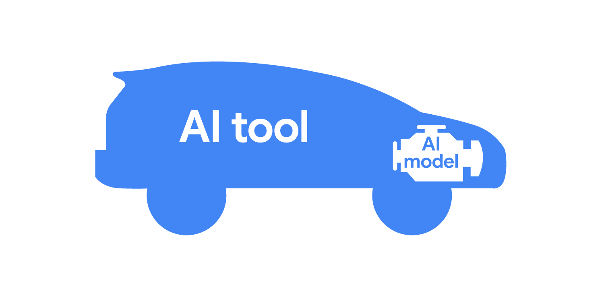

i# AI

Computer programs that can complete cognitive tasks typically associated with human intelligence. 

AI has existed for awhile now. Some examples of early implementations include recommendation systems, chatbots, and image recognition systems.

AI is also a broad field that includes machine learning, deep learning, natural language processing, computer vision, robotics, and more.

AI is powered by __machine learning__ algorithms, which allow it to learn from data and improve its performance over time. These algorithms can be trained on large datasets to recognize patterns, make predictions, and perform tasks that would be difficult or impossible for humans to do manually.

Machine learning is a subset of AI that focuses on the development of algorithms that can learn from and make predictions based on data. It involves training models on large datasets to recognize patterns and make decisions without being explicitly programmed. Its often used by AI to make sense of large amounts of data and to automate tasks that would be difficult or impossible for humans to do manually.

Machine Learning is built using __Training Sets__, which are datasets that are used to train the model / AI. The model is then tested on a separate dataset called the Test Set, which is used to evaluate the performance of the model. The model is then fine-tuned based on the results of the test set.

__Training sets__ provide ML programs with examples of what to expect and how to respond. 

# AI development techniques

__Artificial intelligence__ refers to computer programs that can complete cognitive tasks typically associated with human intelligence. There are two main techniques used to design AI programs:

- __Rule-based techniques__ involve creating AI programs that strictly follow predefined rules to make decisions. For example, a spam filter using rule-based techniques might block emails that contain specific keywords using its predefined logic.

- __Machine learning techniques__ involve creating AI programs that can analyze and learn from patterns in data to make independent decisions. For example, a spam filter using these techniques might flag potential spam for the recipient to review, preventing automatic blocking. If the recipient marks emails from trusted sources as safe, the spam filter learns and adapts its logic to include similar emails from that sender in the future.

In general, __rule-based techniques__ are commonly used for tasks that require rigidity, such as blocking messages from untrusted senders that are obviously spam, like requests for bank transfers or private information. 

Conversely, __ML techniques__ are better suited for tasks demanding flexibility and adaptability, like learning to recognize that messages from trusted senders containing typos are not spam.

# Approaches to training ML programs

__Supervised learning__

Using  this approach, AI designers provide the ML program with a labeled training set of data, and the program learns from that data. A labeled training set includes data that is labeled or tagged, which provides context and meaning to the data. For instance, an email spam filter that's trained with supervised learning would use a training set of emails that are labeled as “spam” or “not spam.” ==Supervised learning is often used when there's a specific output in mind.==

__Unsupervised learning__

In this approach, AI designers provide the ML program with an unlabeled training set of data, and the program learns from that data. An unlabeled training set includes data that does not have labels or tags. For instance, ML might be used to analyze a dataset of unsorted  email messages and find patterns in topics, keywords, or contacts. In other words, ==unsupervised learning is used to identify patterns in data without a specific output in mind.==

__Reinforcement learning__

In this approach, AI designers provide the ML program with data that allow it to learn by  trial-and-error. The program learns to do this by getting rewarded for making good choices that lead to the desired results. ==Reinforcement learning is commonly used by conversational AI tools. As these tools receive feedback from users and AI designers, they learn to generate effective responses.==

Each ML technique has its own strengths and weaknesses. Depending on the type of data that's available and what's needed to solve the particular problem, AI designers may use one, two, or all three of these techniques to produce an AI-powered solution.

# Generative AI

__Generative AI__ is a type of AI that can create new content, such as text, images, or music, based on the patterns it has learned from the training data. It uses techniques like deep learning and neural networks to generate new content that is similar to the training data.

Generative AI is able to understand natural language. Heres the process: 
  1. Provide input
  2. Data is processed
  3. Output is generated 

__Natural Language__ refers to the way humans communicate with each other using spoken or written language. It includes the use of words, phrases, and sentences to convey meaning and express ideas. Natural language processing (NLP) is a subfield of AI that focuses on enabling machines to understand and interpret human language.

> Advancements in supervised, unsupervised, and reinforcement learning have helped pave the way for __generative AI__ —AI that can generate new content, like text, images, or other media. When users provide input in the form of a __prompt__ —text input that provides instructions to the AI model on how to generate output—the AI tool processes this input to generate new content.

> For instance, all three approaches play distinct roles in conversational AI tools. Supervised learning equips conversational AI tools with foundational dialogue data, enabling them to respond to common conversational cues appropriately. Unsupervised learning enables them to interpret nuances in language, like colloquialisms, that occur naturally in conversation. Reinforcement learning further strengthens these tools by allowing them to improve their responses in real-time based on user feedback. This enables them to adapt to the conversational context and engage in natural conversations.

Benefits of generative AI include:
- **Efficiency**: It can automate content creation, saving time and resources.
- **Personalization**: It can generate tailored content based on user preferences and behavior.
- **Better decision-making**: It can analyze large datasets and generate insights that help businesses make informed decisions.

Capabilities of AI include:
- Generate content: It can create text, images, music, and other media based on the patterns it has learned from the training data.
- Analyze information quickly: It can process large amounts of data and generate insights that help businesses make informed decisions.
- Answer questions: It can understand natural language and provide answers to questions based on the information it has been trained on.
- Simplify day-to-day tasks: It can automate repetitive tasks, such as data entry or customer service responses, freeing up time for more complex tasks.

Limitations of AI include:
- Can't learn independently: Generative AI relies on the data it has been trained on, and it cannot learn or adapt to new information without additional training.
- Bias in training data: If the training data contains biases, the AI model may generate biased content.
- Can contain errors: Generative AI can produce content that is factually incorrect or nonsensical, especially if the training data is flawed or incomplete. These are known as __hallucinations__ - Ai outputs that are not based on factual information or reality, but rather generated based on patterns learned from the training data.

Types of generative AI tools include:
  - Text 
  - Image
  - Audio
  - Video
  - Code

__Text Generators__ are AI tools that can create text based on input prompts. They use generative AI techniques to analyze the patterns in the training data and generate new text that matches the input prompt. Some popular text generators include OpenAI's GPT-3, Google's BERT, and Facebook's RoBERTa.

Conversational AI tools

## Conversational AI tools  

Conversational AI tools can process text requests and generate text responses. Their ability to simulate human-like conversations enables them to provide detailed and nuanced answers to questions on a wide variety of subjects.

You might use conversational AI tools for tasks such as researching online information, translating between languages, analyzing long documents, brainstorming ideas, planning schedules, proofreading text, and much more. 

Example tools include:

__Anthropic Claude__

  - Description: Anthropic Claude can complete problem-solving tasks, like finding mathematical solutions, translating between languages, and summarizing long documents. 
  - Stand-alone or integrated: Stand-alone

__Gemini__

  - Description: Supercharge your creativity and productivity with Gemini. Chat to start writing, planning, learning and more with Google AI. 
  - Stand-alone or integrated: Both

__Microsoft Copilot__

  - Description: Integrated with Microsoft Edge, Microsoft Copilot can help with online searches to find information, compare products, and summarize web page content.
  - Stand-alone or integrated: Both

__ChatGPT__

  - Description: ChatGPT can generate ideas, plan schedules, debug code, and proofread text.
  - Stand-alone or integrated: Stand-alone

Productivity and writing assistants

## Productivity and writing assistants

AI productivity and writing assistants can help with workplace tasks. They might provide grammar or spelling suggestions, generate a summary of a long document, or solve problems. Here are some examples: 

__Clockwise__

  - Description: Clockwise is a calendar tool that learns users’ work habits to automatically schedule and manage calendar events.
  - Example industries: Consulting, technology, sales
  - Stand-alone or integrated: Stand-alone

__Grammarly__

  - Description: Grammarly is a writing assistant that can help users edit and write clear, concise text.
  - Example industries: Creative writing, education, marketing
  - Stand-alone or integrated: Stand-alone

__Jasper__

  - Description: Jasper is a writing assistant intended for marketing tasks, like drafting social media posts, emails, and landing page content.
  - Example industries: Copywriting, marketing, sales
  - Stand-alone or integrated: Stand-alone

__NotebookLM__

  - Description: NotebookLM integrates into document apps, like Google Docs, and helps summarize or ask specific questions about text, notes, and sources.
  - Example industries: Content writing, finance, sales
  - Stand-alone or integrated: Both

__Notion AI__

  - Description: Notion AI is a writing assistant built into Notion, a productivity and note-taking software tool.
  - Example industries: Development, marketing, product management, sales
  - Stand-alone or integrated: Integrated

__AI by Zapier__

  - Description: AI by Zapier is a built-in productivity tool that allows AI automation to be integrated with the apps and workflows already connected through Zapier.
  - Example industries: Engineering, marketing, project management, technology
  - Stand-alone or integrated: Integrated

  

 

__Image Generators__ are AI tools that can create images based on text prompts. They use generative AI techniques to analyze the patterns in the training data and generate new images that match the input prompt. Some popular image generators include DALL-E, Midjourney, and Stable Diffusion.

Image-generative AI tools

## Image-generative AI tools

Image-generative AI tools use generative AI techniques to analyze the patterns in the training data and generate new images that match the input prompt. Some popular image-generative AI tools include:

__Adobe Firefly__

  - Description: Built into the Adobe suite, Firefly can generate and edit images.
  - Example industries: Design, education, marketing
  - Stand-alone or integrated: Integrated

__Canva Magic Design™__

  - Description: Canva Magic Design is a tool that generates text and image content in Canva, an online graphic design tool.
  - Example industries: Design, education, marketing
  - Stand-alone or integrated: Integrated

__DALL-E__

  - Description: Integrated with ChatGPT, DALL-E generates images from text prompts.
  - Example industries: Design, education, marketing
  - Stand-alone or integrated: Integrated

__ElevenLabs__

  - Description: ElevenLabs is a speech AI tool that can generate spoken voice-over audio from text in different languages.
  - Example industries: Content creation, education, marketing, production
  - Stand-alone or integrated: Stand-alone

__Google Ads__

  - Description: Google Ads helps businesses create and manage digital advertising campaigns. It features AI integration to help generate ad content and boost performance. Learn more about how to make AI work for your business with [Google Ads AI Essentials](https://www.google.com/ads/ai-essentials) and the [AI Explored video series](https://www.youtube.com/playlist?list=PL0u4h5QI6h7ZqZ3jO_4J8wQsZqT8n8n4r3).
  - Example industries: Marketing, Advertising
  - Stand-alone or integrated: Integrated

__Midjourney__

  - Description: Integrated into Discord, Midjourney can generate images from text prompts.
  - Example industries: Design, education, marketing
  - Stand-alone or integrated: Integrated

__Runway__

  - Description: Runway can generate a new video from a text prompt or edit an existing video's style or focus area, and remove people or other elements.
  - Example industries: Content creation, design, marketing, production
  - Stand-alone or integrated: Stand-alone

__Code Generators__ are AI tools that can create code based on input prompts. They use generative AI techniques to analyze the patterns in the training data and generate new code that matches the input prompt. Some popular code generators include OpenAI's Codex, GitHub Copilot, and Tabnine.

Code Generative AI tools

## Code-generative AI tools

These tools help with software development tasks across various programming languages. They function as an AI pair programmer—offering suggestions, debugging errors, finding solutions to coding challenges, and much more:

__Gemini Code Assist__

  - Description: A plugin for popular integrated development environments (IDEs), Gemini Code Assist allows users to prompt Gemini within their IDEs to generate code, troubleshoot bugs, and answer questions about software development.
  - Example industries: Software development, information technology, web development, systems administration
  - Stand-alone or integrated: Integrated

__GitHub Copilot__

  - Description: A plugin for popular IDEs and built into GitHub, Copilot can write and suggest code, suggest descriptions for pull requests, translate multiple languages into code, and index repositories.
  - Example industries: Data science, software development, web development
  - Stand-alone or integrated: Integrated

__Tabnine__

  - Description: Tabnine can be a plugin to many popular code editors to help speed up delivery and keep code safe.
  - Example industries: Data science, software development, web development
  - Stand-alone or integrated: Integrated

__Jupyter AI__

  - Description: Jupyter is an open-source platform for coding, and this built-in tool includes a chat interface, which can be used to generate code, fix coding errors, and ask questions about files.
  - Example industries: Data science, software development, web development
  - Stand-alone or integrated: Integrated

 

**Generative AI tools** include:
- __Standalone tools__: These are AI tools that can be used independently, such as text generators, image generators, and code generators. They can be used to create content, automate tasks, and assist with various tasks.
- __Integrated tools__: These are AI tools that are integrated into existing software applications, such as chatbots, virtual assistants, and recommendation systems. They can be used to enhance the functionality of existing software applications and provide users with a more personalized experience.
- __Custom Solutions__: These are AI tools that are built specifically for a particular use case or industry. They can be used to solve specific problems and provide users with a tailored solution.

To use a <ins>Generative AI tool</ins>, we require a __prompt__ - a text input that provides instructions to the AI model on how to generate output. The prompt can be as simple or as complex as needed, depending on the desired output.

[PAIR Explorables](https://pair.withgoogle.com/explorables/)
 is an optional resource for anyone who wants to learn more about AI. It is a collection of interactive articles that are designed to make key AI concepts more accessible and understandable. PAIR Explorables covers a wide range of topics, including:

  - Machine learning basics
  - Fairness and bias in AI programs
  - Data and privacy considerations in AI
  - Potential risks and benefits of AI

# AI Tools and Models

__AI tools__ and __AI models__ are two key components of AI technology.

__AI tools__ - AI-powered software that can automate or assist users with a variety of tasks. They are powered by __AI models__. 

__AI models__ - The underlying algorithms and data that power AI tools. They are trained on large datasets to recognize patterns, make predictions, and perform tasks that would be difficult or impossible for humans to do manually.

Some AI tools ==leverage multiple AI models==, working together as a "family," to achieve more flexibility and perform a wider range of tasks. Each model within the family might be specialized for a specific subtask, ultimately contributing to the overall functionality of the AI tool. You'll explore these types of multimodal tools later in this course.

## Process of Training AI models: 

AI designers and engineers develop AI models through a process called __training__. Training involves providing the AI model with a large dataset of examples, which it uses to learn patterns and relationships within the data. The model is then tested on a separate dataset to evaluate its performance and make adjustments as needed.

Here’s an example of the typical steps a designer might take in this process, in this case for building a model that predicts rainfall:

1. __Define the problem to be solved.__   
AI designers and engineers want to predict rain to help people stay dry when commuting to and from work. They start by considering AI’s capabilities and limitations before identifying an AI solution.

  1. __Collect relevant data to train the model.__   
  AI designers and engineers gather historical data of days when it rained and days when it didn't rain over the past 50 years.

  1. __Prepare the data for training.__   
  AI designers and engineers prepare the data by labeling important features, such as outdoor temperature, humidity, and air pressure, and then noting whether it rained. It's also common to separate the data into two distinct sets: a training set and a validation set to test with later.

  1. __Train the model.__   
  AI designers and engineers apply machine learning (ML) programs to the prepared training data. As the ML programs analyze the data, they begin learning how to recognize patterns that indicate the likelihood of rainfall, such as the combination of high temperatures, low air pressure, and high humidity.

  1. __Evaluate the model.__   
  AI designers and engineers use the validation set they prepared earlier to assess their model's ability to predict rainfall accurately and reliably. Analyzing a model's performance can uncover potential issues impacting the model, such as insufficient or biased training data. If any issues exist, the AI designers and engineers may revisit an earlier step in this process to try a different approach. Once the model performs well with its validation set, the process continues to the next step.

  1. __Deploy the model.__   
  When the AI designers and engineers are satisfied with their model's performance, they deploy it in an AI tool—helping people in their city stay dry on their way to work!

Model training is an <ins>iterative process</ins>. AI designers and engineers can repeat each step as many times as necessary and make adjustments until they create the best model possible. 

__AI Augmentation__ - The process of using AI to improve a work product, whether by making it easier to do or higher in quality. 

__AI automation__ - The process of using AI to automate a task or process, such as automating data entry or automating customer service responses, without any human intervention.

# Human in the Loop Approach

__Human in the Loop (HITL)__ is an approach to AI development that involves human input and oversight at various stages of the AI lifecycle. This approach ensures that AI systems are designed, trained, and deployed with human judgment and expertise, leading to more accurate and reliable AI models. This approach is important for developing __responsible AI__. 

__Responsible AI__ refers to the practice of developing and deploying AI systems in a way that is ethical, transparent, and accountable. It involves considering the potential impact of AI on society and ensuring that AI systems are designed to be fair, unbiased, and respectful of user privacy.

Aspects of responsible AI include:
  - Managing the limitations of AI models such as __knowledge cutoffs__, biases, and hallucinations.

  - __Knowledge cutoffs__ refer to the point in time when an AI model was last trained on new data. This means that the model may not have access to the most up-to-date information, which can lead to inaccuracies in its responses. Knowledge cutoffs can be managed by periodically retraining the model on new data, otherwise it might lead to __hallucinations__ (an AI output that is not based on factual information or reality) if the AI tries to generate information that is not based on factual information or reality.

Assess whether to apply generative AI to a task: 
  - Is the task generative in nature?
  - Can the task be iterated on to achieve a better result?
  - Are there resources to provide human oversight and feedback? (is there a human in the loop?)

# Prompt Engineering

__Prompt engineering__ is the process of designing and optimizing prompts to achieve desired outcomes from AI models. It involves crafting clear, concise, and specific prompts that guide the AI model to generate relevant and accurate responses.

