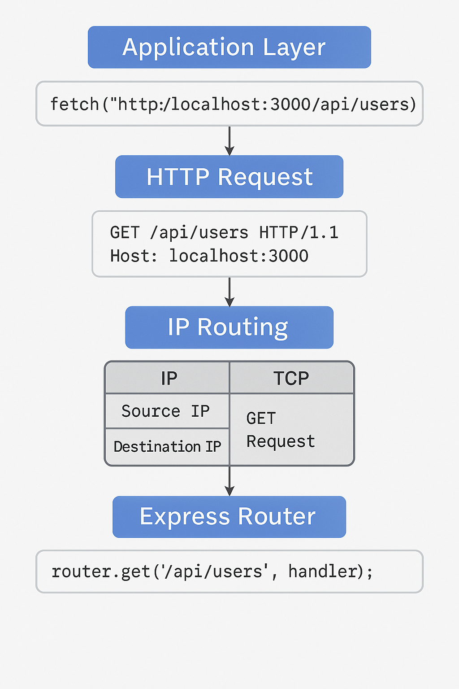

# HTTP
- __HTTP__ is a core operational protocol of the internet. They allow your web browser to communicate with a web server that hosts a website. HTTP is a communication protocol you use whenever you browse the web and transfers web data/resources. It is a request-response based protocol (HTTP request - HTTP response).
- HTTP are used on top of TCP to transfer webpages and content from websites. WHAT IS THE DIFFERENCE? __HTTP vs TCP__?:  
  - HTTP (application layer) is concerned with the content of the data that's being sent. HTTP defines the syntax and semantics of the messages being exchanged. TCP (transport layer) is focused on the deliver of data packets.
- The __HTTP request__ consists of a method, path, version, and header and optionally a body.

```js
  GET / HTTP/1.1 //method, path, version
  Host: www.example.com //header; indicates the server to which the request is directed.
  Accept: text/html //header; specify the media types that the client accepts.

  //body
  Content-Type: application/x-www-form-urlencoded //indicates form data
  Content-Length: 27 //indicates the length of the body

  username=johndoe&password=secret123 
```

- The method is the type of request (GET (retrieve), POST (send), PUT (update on the web server), DELETE (remove), etc.)
- The path is the URL of the resource you want to access from the server
- The version is the HTTP version 1.1 and 2.0 are most used.
- Headers contain information about the request and the client that is making that request. 
  - The `Host:` header specifies the host of the server and indicates where the resource is requested from.
  - The `User-Agent:` header informs the web server of the application that is making the request. It often includes the operating system (Windows, Mac, Linux), version, and application vendor.
  - The `Accept:` header informs the web server what type of content the client will accept as the response.
  - The `Accept-Language:` header indicates the language and optionally the locale that the client prefers.
- Body contains the actual data being sent to the server. For example, the contents of a form submission. A request body is often included when using the HTTP POST and PUT methods to transmit data.
  - The `Content-Type:` header indicates the type of content being transmitted in the request body.
  - The `Content-Length:` header indicates the length of the request body.

The __HTTP response__ consists of a status code, header, and body:

```js
  HTTP/1.1 200 OK //version, status code and status message
  Content-Type: text/html //header; specify the media type that the server sends back
  Content-Length: 100 //header; specify the length of the body

  //body
    //html code inside...

  // express routes receive this response and decide based on http method on what to do with it and how to respond. 
```
The common response headers are:
- The `Date` header specifies the date and time the HTTP response was generated.
- The `Server` header describes the web server software used to generate the response.
- The `Last-Modified` header indicates the date and time that the resource was last modified.
- The `Content-Length` header describes the length of the response.
- The `Content-Type` header describes the media type of the resource returned (e.g. HTML document, image, video).

The status code is a 3-digit number that indicates the result of the request. The status message is a text representation of the status code:
- __100-199 - Informational__ - Request received, continuing process. Provisional, may be followed by another message later. The most common is `100 CONTINUE` - the web client should continue the request or ignore the response if it is not necessary

- __200-299 - Success__ - Request completed successfully. The most common is `200 OK` - the request was successful

- __300-399 - Redirection__ - Further action needs to be taken in order to complete the request. It indicates that the requested resource has been moved to a new URL/path. The most common is `301 MOVED PERMANENTLY` & `302 FOUND` 302 represents a temporary redirect and 301 represents a permanent redirect. For temporary redirects, the browser will perform a GET request on the new URL.

- __400-499 - Client Error__ - The request contains bad syntax and cannot be fulfilled by the server. The most common: 
  - `400 BAD REQUEST` - the request was invalid because of bad data sent to the web server. 
  - `401 UNAUTHORIZED` - the client is not authorized to make the request, the user must log into an account before the request is processed. 
  - `403 FORBIDDEN` - the client is authorized to make the request, but is not allowed to access the requested resource due to the web server not processing the request. This is often used to indicate that a user does not have sufficient permissions to execute an action in a web application. 
  - `404 NOT FOUND` - the server cannot find the requested resource.
  
    - A clear distinction between 400 and 404 is that: 
      - 400 is a request level issue. The endpoint itself works, but the content or parameters are wrong.
      - 404 is a server level issue. The endpoint simply does not exist or cannot be found. 

- __500-599 - Server Error__ - The server failed to fulfill an apparently valid request.
  - `500 Internal Server Error` - A generic error status code given when an unexpected error or condition occurred while processing the request.
  - `502 Bad Gateway` - The web server received an invalid response from the Application Server.
  - `503 Service Unavailable` - The web server cannot process the request.

The meaning of OK for __HTTP request methods__
- `GET` - the resource is found and is included in the body of the HTTP response.
- `POST` - the resource was successfully transmitted to the server
- `PUT` - the resource was successfully updated/transmitted to the server
- `DELETE` - the resource was successfully deleted from the server

__HTTPS__ is the __secure version__ of HTTP. It is used to encrypt data in transit and secures the connection between 2 computers. Before a request is sent, it is encrypted with a secret code (key) that is known only to the server. Only the other computer can turn that secret code back to its original content. Your web browser indicates __HTTPS with the locked icon__ in the address bar

# Other Protocols

__Dynamic Host Configuration Protocol (DHCP)__
You've learned that computers need IP addresses to communicate with each other. When your computer connects to a network, the Dynamic Host Configuration Protocol or DHCP as it is commonly known, is used to assign your computer an IP address.
Your computer communicates over User Datagram Protocol (UDP) using the protocol with a type of server called a DHCP server. The server keeps track of computers on the network and their IP addresses. It will assign your computer an IP address and respond over the protocol to let it know which IP address to use. Once your computer has an IP address, it can communicate with other computers on the network.

__Domain Name System Protocol (DNS)__
Your computer needs a way to know with which IP address to communicate when you visit a website in your web browser, for example, meta.com. The Domain Name System Protocol, commonly known as DNS, provides this function. Your computer then checks with the DNS server associated with the domain name and then returns the correct IP address.

__Internet Message Access Protocol (IMAP)__
Do you check your emails on your mobile or tablet device? Or maybe you use an email application on your computer?
Your device needs a way to download emails and manage your mailbox on the server storing your emails. This is the purpose of the Internet Message Access Protocol or IMAP.

__Simple Mail Transfer Protocol (SMTP)__
Now that your emails are on your device, you need a way to send emails. The Simple Mail Transfer Protocol, or SMTP, is used. It allows email clients to submit emails for sending via an SMTP server. You can also use it to receive emails from an email client, but IMAP is more commonly used.

__Post Office Protocol (POP)__
The Post Office Protocol (POP) is an older protocol used to download emails to an email client. The main difference in using POP instead of IMAP is that POP will delete the emails on the server once they have been downloaded to your local device. Although it is no longer commonly used in email clients, developers often use it to implement email automation as it is a more straightforward protocol than IMAP.

__File Transfer Protocol (FTP)__
When running your websites and web applications on the Internet, you'll need a way to transfer the files from your local computer to the server they'll run on. The standard protocol used for this is the File Transfer Protocol or FTP. FTP allows you to list, send, receive and delete files on a server. Your server must run an FTP Server and you will need an FTP Client on your local machine. You'll learn more about these in a later course.

__Secure Shell Protocol (SSH)__
When you start working with servers, you'll also need a way to log in and interact with the computer remotely. The most common method of doing this is using the Secure Shell Protocol, commonly referred to as SSH. Using an SSH client allows you to connect to an SSH server running on a server to perform commands on the remote computer.
All data sent over SSH is encrypted. This means that third parties cannot understand the data transmitted. Only the sending and receiving computers can understand the data.

__Secure File Transfer Protocol (SFTP)__
The data is transmitted insecurely when using the File Transfer Protocol. This means that third parties may understand the data that you are sending. This is not right if you transmit company files such as software and databases. To solve this, the SSH File Transfer Protocol, alternatively called the Secure File Transfer Protocol, can be used to transfer files over the SSH protocol. This ensures that the data is transmitted securely. Most FTP clients also support the SFTP protocol.


# If we walk through a GET request:

📶 __When a request comes in:__
1. A client (browser, frontend app, curl, etc.) sends an HTTP request through fetch (method:GET) or axios.get() for example.
2. That HTTP request is wrapped in:
    - a TCP segment
    - which is wrapped in an IP packet
3. The IP packet arrives at your machine’s network interface (like your Wi-Fi card or Ethernet port).

__The Operating System (OS) steps in first:__
- It strips away the IP header
- Then passes the TCP segment to the TCP stack
- TCP reorders segments if needed and reassembles the full HTTP message

__Then it hits Node.js:__
- Node.js’s built-in http module handles the raw HTTP request
- It parses headers, method, URL, etc.

__Finally... it reaches Express:__
- Express is built on top of Node’s http module.  
- Express routes are telling where HTTP requests go once they arrive at the server.  
- Express routes check if the request method and path match to what express route is configured to handle.
- It gives you a clean, friendly interface to interact with the request:

```js
app.get('/api', (req, res) => {
  // `req` is now a JS object that holds parsed data
  res.send('Hi!');
});
```

OR:

1. Your frontend issues a GET request
    - This is through fetch(, {method: GET}) or axios.get()
    - This is the GET method from the HTTP protocol.
    - It includes a URL path like /api/users.

2. HTTP builds the request   
The request includes:
    - Method: GET
    - Headers: like Host, User-Agent, maybe Content-Type
    - No body, because GET doesn’t send one
    - Path: /api/users

3. HTTP request is passed to TCP
    - TCP wraps the HTTP request into a segment
    - TCP handles ordering and reliability

4. TCP passes to IP
    - IP wraps the TCP segment into a packet
    - Includes source/destination IP addresses

5. Packet travels to the server
    - In dev, that’s usually localhost
    - In production, it’s your real server's IP

6. Your Express server receives the request
    - It listens on a port (like 3000)
    - express() is listening for HTTP requests
    - The method is matched: router.get("/api/users")
    - ==If the method and path match, your route logic runs==

