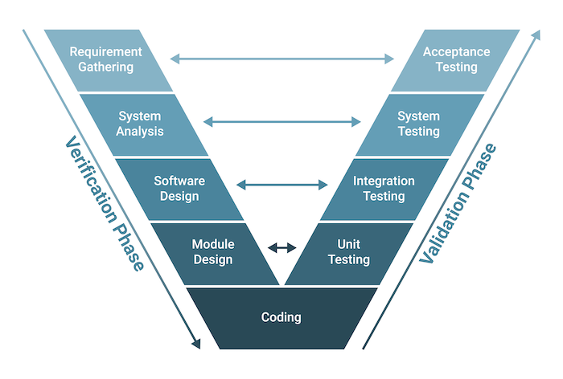

# Software Development Life Cycle (SDLC)

├── [Planning](#1-planning--business-analysis)  
├── [Analysis](#2-requirements-analysis)  
├── [Design](#3-design)  
├── [Implementation](#4-implementation--coding--development)  
├── [Testing](#5-testing)   
├── [Deployment](#6-deployment)  
└── [Maintenance](#7-maintenance)

## 1. Planning / Business Analysis

<mark>“What are we building, and why?”</mark>  
Stakeholders gather to define the goals, scope, budget, and timeline.  
Key outcomes:
* Feasibility study
* High-level project roadmap
* Cost/benefit analysis
* Risk identification

> This initial phase involves defining the project scope, objectives, and creating a project plan.   
> Identify the current state. Where are we now. What do we need to do?
> 
> The team determines the cost and resources required for implementing the analyzed requirements. It also details the risks involved and provides sub-plans for softening those risks.
> 
> In other words, the team should determine the feasibility of the project and how they can implement the project successfully with the lowest risk in mind.

## 2. Requirements Analysis

<mark>“What does the system need to do?”</mark>

Business analysts and developers work with stakeholders/customers to define functional and non-functional requirements:
- Functional: What features must the system have?
- Non-functional: Performance, scalability, security, etc.

__Requirements__ are statements of what the system should do (functional) or how it should perform (non-functional)

🛠 Tools: User stories, use cases, requirement specs, diagrams

> Customer describes what they want and how they want it used.
> 
> We need to have a clear understanding of:
> 
> - What we want to have (desire to have – initial plans).
> - What we must have (absolutely necessary).
> - What is just gravy (extra stuff – not expected enhancements).
> 
> We need to have a picture in mind.
> 
> "What are the current problems?" This stage of the SDLC means getting input from all stakeholders, including customers, salespeople, industry experts, and programmers. Learn the strengths and weaknesses of the current system with improvement as the goal.

## 3. Design

<mark>“How will we build the system?”</mark>

Architects and developers define:
- System architecture (frontend/backend separation)
- Database design (ERDs, schemas)
- API contracts (RESTful endpoints)
- UI/UX wireframes
- Security protocols

🛠 Tools: UML diagrams, ERDs, wireframes, Swagger, Figma

> How do we build it? 
> 
> Architectural Blueprints are created with various considerations:
> - Hardware.
> - Software.
> - Service/Product Availability.
> - Service/Product Capacity.
> - Security.
> - Environmental Considerations.
> 
> __System design__ involves creating both a High-Level Design (HLD), which is like a __roadmap showing the overall plan__, and a Low-Level Design (LLD), which is a detailed guide for programmers on __how to build__ each part.
>
> High-Level Design (HLD) - lists the functional aspects of the various modules, along with the final result. 
> - System Design  
> - Database Design 
> - Systems, services, platforms, and relationships among modules
> - description of hardware, software interfaces, and also user interfaces.
> - It is also known as macro level/system design
> - It is created by solution architect.
> - The workflow of the user’s typical process is detailed in the HLD, along with performance specifications.
> 
> Low-Level Design (LLD) - details the logic and execution of each module in an HLD 
> - It describes detailed description of each and every module means it includes actual logic for every system component and it goes deep into each modules specification.
> - It is also known as micro level/detailed design.
> - It is created by designers and developers.
> - It involves converting the high-level design into a more detailed blueprint, addressing specific algorithms, data structures, and interfaces.
> - LLD serves as a guide for developers during coding, ensuring the accurate and efficient implementation of the system’s functionality.

> 
> A description of the recommended solution is converted into logical and then physical system specifications.
> 
> "How will we get what we want?" This phase of the SDLC starts by turning the software specifications into a design plan called the Design Specification. All stakeholders then review this plan and offer feedback and suggestions. It's crucial to have a plan for collecting and incorporating stakeholder input into this document. Failure at this stage will almost certainly result in cost overruns at best and the total collapse of the project at worst.

## 4. Implementation / Coding/ Development

<mark>“Coding time!!!”</mark>

Developers break the system into modules and write code based on the design.

Code is often written in sprints (if using Agile).

Use of:
- Version control (Git)
- CI/CD (Continuous Integration/Continuous Delivery (or Continuous Deployment))
- Code reviews and documentation

🛠 Tools: Node.js, Express, React, PostgreSQL, Docker

> Involves taking all of the detailed design documents from the design phase and transforming them into the actual system.
> 
> "Let's create what we want."
> At this stage, the actual development starts. It's important that every developer sticks to the agreed blueprint. Also, make sure you have proper guidelines in place about the code style and practices.

## 5. Testing

<mark>“Does it work correctly and reliably?”</mark>

QA engineers or developers run tests to find bugs.
Types of testing:

- Unit testing (individual functions)
- Integration testing (between modules)
- System testing (whole app)
- User acceptance testing (UAT)
- Security & performance testing

🛠 Tools: Jest, Mocha, Supertest, Cypress, Postman

> __Software Quality__ is best determined by how well the software meets the requirements.
> 
> Other types of testing:
> - User Experience Testing
> - Functionality Testing
> - Security Testing (does the release meet the acceptable risk profile)
> - Load Testing (will service be able to support and handle traffic and maintain its performance)
> - Performance Testing (Will performance in live environment be as expected than in test environment)
> - Compatibility Testing (Will this services affect other services in the system? We need to make sure its compatible with other services without bugging them) 
> 
> __End-users__ must be trained in how to interact with new systems prior to the new rollout.  
> 
> Not having users ready to interact with the new system is a major risk to a successful implementation.
> 
> 
> Verifies that the system works and meets all of the business requirements defined in the analysis phase
> 1. Write the test conditions
> 2. Perform the testing of the system
> 
> "Did we get what we want?" In this stage, we test for defects and deficiencies. We fix those issues until the product meets the original specifications.

Requirements Traceability Matrix:  
A project management and software QA tool that ensures each requirement is accounted for throughout the software development lifecycle — from definition to testing.
We update the pass fail status on the test execution report.

Types of Traceability: 
| Type                     | What It Does                                  | Example                                                         |
|--------------------------|-----------------------------------------------|-----------------------------------------------------------------|
| Forward Traceability     | From requirement → design/code/test           | “This requirement is implemented in X and tested in Y.”         |
| Backward Traceability    | From test/code → original requirement         | “Why does this function exist? Oh, it maps to RQ-05.”           |
| Bidirectional Traceability | Both directions                              | “Every requirement has code + test, and every test/code maps to a requirement.” |

A typical RTM table maps a requirement to:

- Where it's designed
- Where it's implemented
- How it's tested
- Whether it’s complete

Imagine a requirement:

RQ-02: Users must be able to reset their password.  
With traceability, you can link that requirement to:  

- 📄 A design doc that explains the UI/flow
- 🧑‍💻 A developer task to implement the feature
- 🧪 A test case that validates it works
- 🔁 A deployment ticket that released it to production

So if someone later asks:  
“Do we have test coverage for password resets?”  
You can trace RQ-02 all the way to TC-05 (test case), see its status, and know for sure.  

More about workflows and diagrams [here](Workflow.md)

## 6. Deployment

<mark>“Let’s put it into the real world.”</mark>

Code is released to:

- Staging (for internal testing)
- Production (live users)
- Use CI/CD pipelines to automate build/test/deploy.
- Can be a manual push or automated on commit.

🛠 Tools: GitHub Actions, Docker, Railway, Heroku, Vercel, AWS, Render

> Deployment moves the product/service into the “live” environment. Once deployed successfully, customers and users can be allowed to begin utilization of the functionality provided.
> 
> At this stage, the goal is to deploy the software to the production environment so users can start using the product. However, many organizations choose to move the product through different deployment environments such as a testing or staging environment.
> 
> This allows any stakeholders to safely play with the product before releasing it to the market. Besides, this allows any final mistakes to be caught before releasing the product.

## 7. Maintenance

<mark>“Keep it running and improving.”</mark>

Monitor for:

- Bugs
- Downtime
- Security vulnerabilities

Add new features based on user feedback

Patch updates, scale infrastructure, refactor code

🛠 Tools: Sentry, New Relic, PostHog, Logs, APM tools

> The Maintenance phase is an ongoing process, and includes:  
> 
> - Maintenance of Hardware/Software.
> - Updates.
> - Upgrades.
> - New Features.

---

# Software Development Hierarchy

[ SDLC ] — the process / practice of building software  
        ↓  
[ Models / Methodology ] — mindset (e.g., Agile, Waterfall, Spiral, Hybrid, Incremental)  
        ↓  
[ Framework ] — practical structure (e.g., Scrum, Kanban)  
        ↓  
[ Tools ] — how you carry it out (e.g., Jira, Trello, Gantt)

🧪 Example:
Let’s say your team is:  
Using Agile (methodology),  
Following the Scrum framework (sprints, roles),  
Managing work in Jira (tool).  

# SDLC

### **==The General Process==**
> What steps should happen to build software?

Its a generic structured life cycle - providing a guideline for every phase for software project. Think of it like a roadmap, blueprint, or recipe.

# Framework 

### **==The Practical Toolbox==** 

> How do we actually carry out those steps in a practical way? Using what tools? 

A framework provides: 
- Roles 
- Rituals / Activities
- Artifacts
- Rules 

Some frameworks include: 
- Scrum
- Kanban

Tools used to support/carry out these frameworks include:
- Jira
- Trello
- Asana
- GitHub Projects
- Gantt Chart

Scrum Process:

Scrum Artifact Hierarchy:   
User Stories -> Product Backlog -> Sprint Backlog -> Task Board -> Burn-Down Chart

# Models
Each of the SDLC models, utilize the same phases from SDLC.  

__Iterative__ (refinement/improvement)  
__Incremental__ (new features, new requirements)

# Waterfall (Linear, Sequential)
> “Plan everything upfront, build everything once.”

- give deliverables all at once before getting feedback on iteration. Rigid and not very flexible.
- linear, sequential process; each phase is completed before moving to the next phase.
- great for small projects with fixed requirements, and well defined scopes.
- ❌ not very flexible 

# V-Model (Testing: Verification + Validation)
> “Design and test in parallel — every development step has a matching test.”
- An extension of Waterfall, but testing is planned in parallel with every development phase.
- Each development phase has a corresponding test phase.
- Testing is built-in from the start
- Very structured and disciplined
- ❌ Inflexible to changes, Costly for smaller projects

From this diagram, every finished the phases of verification, we go back up the validation phase, and start from unit testing to acceptance testing.

Validation Phases:

__Unit Testing → Module Design (LLD)__
  - Test individual units/components of code in isolation.
  - Validate the logic, algorithms, and expected outputs.

__Integration Testing → Architecture Design (HLD)__
  - Ensure that different modules or services interact correctly.
  - Identify interface issues between components.
  - Test ex: Communication between login and dashboard modules
  - Test ex: API requests/responses between front-end and back-end
  - Test ex: Data flow across subsystems
  
__System Testing → System Design (functional + technical specifications)__
  - Test the whole system as a complete application.
  - Ensure that it meets the specified functional and non-functional requirements.
  - Performed by Independent QA/test teams
  
__Acceptance Testing → Requirements Analysis (business/user requirements)__
  - Validate the system against business/user requirements.
  - Ensure that the system is user-friendly and easy to use.
  - Determine whether to accept or reject the product.
  - Performed by end users, stakeholders, or clients (sometimes with help from testers)

Example: Hospital Patient Management System

This system should allow:

- Registering patients
- Assigning doctors
- Scheduling treatments
- Billing and generating reports

Because it’s safety-critical and must comply with healthcare regulations, the V-Model is ideal.

1. ✅ Requirements Analysis    
Define what the system should do:  
e.g., “Doctors must be able to view assigned patients.”  
- 🔁 Corresponding Test: Acceptance Testing
  - After full development, test if system meets user needs
  - e.g., “Verify doctors can access their assigned patient list.”

2. 🧠 System Design  
Define system modules and interactions  
e.g., modules for Patients, Doctors, Scheduling, Billing
- 🔁 Corresponding Test: System Testing 
  - Test end-to-end flows through multiple modules
  - e.g., register patient → schedule treatment → generate bill

3. 🏗️ Architecture Design / High-Level Design  
Define interfaces and communication between subsystems
e.g., How Scheduling module talks to the Calendar API

- 🔁 Corresponding Test: Integration Testing  
  - Test interactions between modules
  - e.g., Verify Scheduling updates Calendar correctly

4. ⚙️ Module Design / Low-Level Design  
Define internal logic of each module
e.g., Logic inside the Billing module (fee + insurance adjustments)

- 🔁 Corresponding Test: Unit Testing
  - Test individual components
  - e.g., Ensure Billing module calculates fees accurately

5. 💻 Coding  
Write actual code for all modules
- After this, you execute the matching tests from the right side of the "V" (bottom up).

# Iterative (Classic Repetition (Iterative), ?Incremental)
> “Build a feature or core slice, refine it through cycles before moving on.”

- Starts with a small set of requirements and grows through multiple iterations.
- Each iteration focuses on a requirement or set of requirements.
- Each iteration includes design, development, and testing.
- Each iteration adds functionality on top of the previous version for the same requirement.
- Iterative can be __optionally incremental__, where each iteration adds a new feature or requirement. 
- Each cycle has design → code → test — like a mini waterfall.
- Feedback is collected after each release / iteration.
- No need to design everything upfront — only what’s needed now
- Allows flexibility and ongoing improvement
- ❌ Not great for projects with strict scope or budget. Architecture might not be planned ahead of time.

Example (Iterative):
- Sprint 1: Build basic login (email + password)
- Sprint 2: Improve UI + add password strength meter
- Sprint 3: Add multi-factor authentication  
==→ You’re revisiting and improving the same feature.==

Difference from Agile: 

| Feature | Iterative Model | Agile Model |
| --- | --- | --- |
| ✅ Is it iterative? | ✅ Yes | ✅ Yes (and also incremental) |
| 🔁 Feedback frequency | At the end of each iteration | Continuous — throughout the iteration |
| 📋 Planning approach | All iterations are often pre-planned | Plans change dynamically based on feedback |
| 💡 Customer involvement | Limited — usually at iteration review | High — customers are involved in every sprint |
| 🧱 Structure | Can be rigid: fixed iterations and phases | Flexible, allows changing priorities |
| 📦 Delivery model | Delivers full or partial system per iteration | Delivers working features frequently |
| 🧭 Focus | Focus on refining the system gradually | Focus on delivering business value continuously |

Iterative is about repeating the process to improve the product.  

Agile is about collaborating closely, delivering frequently, and adapting constantly (a much more collaborative and larger methodology). — and it happens to be iterative.

# Spiral (Iterative + Incremental)

> “Plan cautiously, build gradually — only after managing the risks.”

A risk-driven model combining iterative and waterfall approaches.

- Strong focus on risk management
- Flexible and allows incremental delivery
- Each loop (spiral) plans, accesses risks, builds, and reviews
- each loop increases scope and complexity. 
- Useful for complex, high-risk projects
- ❌ Requires expertise in risk assessment, and can be expensive and time-consuming

The main difference from Iterative models, is Risk. All else is very similar to iterative Model.  
You target features that pose the most risk first, and mitigate the risk as you go.

Imagine you're building a healthcare system:

🔁 Iterative:
- Iteration 1: Basic patient record system
- Iteration 2: Add appointment scheduler
- Iteration 3: Add prescriptions module

Risks may be considered informally, but the focus is on building and refining features.

🌀 Spiral:
- Loop 1: Identify highest risk (e.g., HIPAA compliance) → Build secure record storage
- Loop 2: Next risk (e.g., downtime) → Add auto-backup and monitoring
- Loop 3: Add appointments only after risk of patient mix-ups is assessed and mitigated

Every feature is planned only after evaluating risks, making it ideal for safety-critical environments.

# Agile Model: Iterative + Incremental + Adaptive

> “Deliver value fast, adapt constantly, and grow with feedback.”