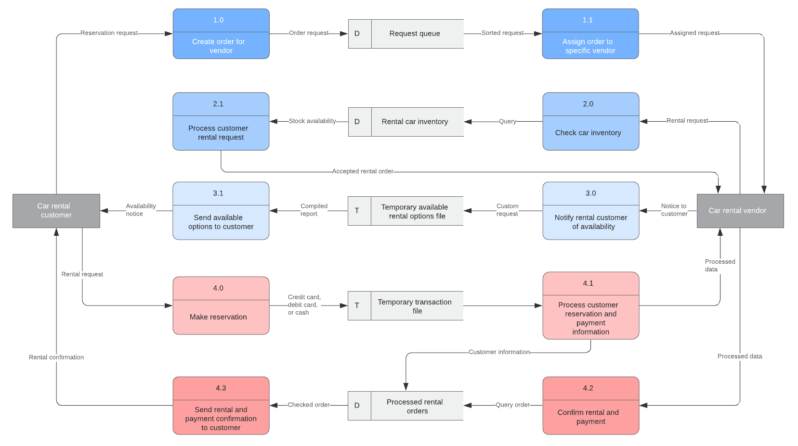
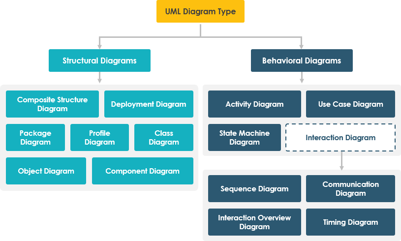
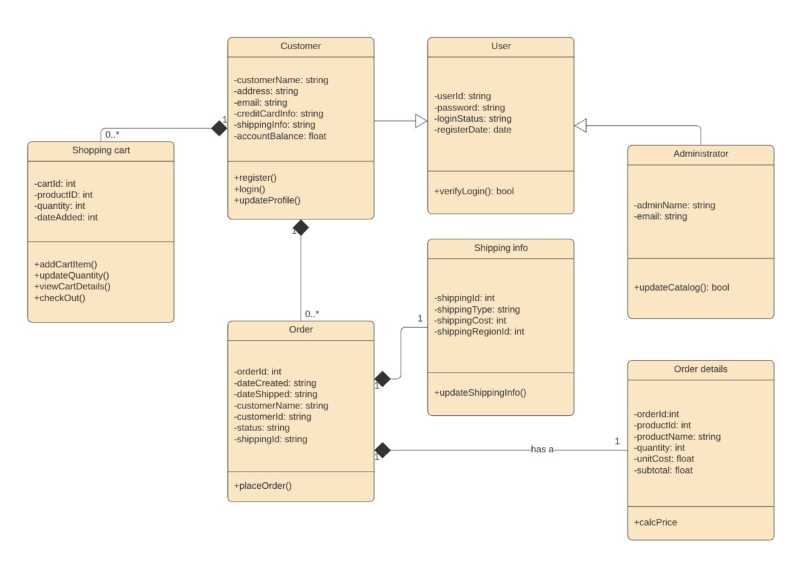
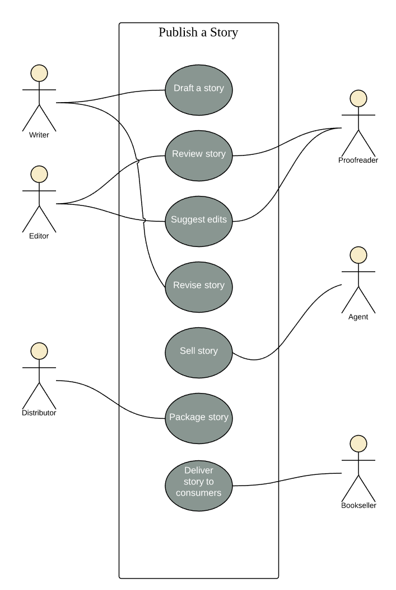
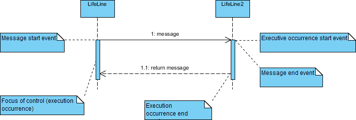

# Workflow / Diagrams

├── [Data Flow Diagram (DFD)](#data-flow-diagram)  
├── [Unified Modelling Language (UML)](#unified-modelling-language)  
├── [Flowchart](#flowchart)  
├── [Implementation](#4-implementation--coding--development)  
├── [Testing](#5-testing)   
├── [Deployment](#6-deployment)  
└── [Maintenance](#7-maintenance)

# Data Flow Diagram

[More here](https://www.rudderstack.com/blog/data-flow-diagram/)  
[LucidChart](https://www.lucidchart.com/blog/data-flow-diagram-tutorial#data-flow-diagrams-symbols-and-notation)

Show how data moves through a system (no decision logic).

A DFD is a visual tool used to map how data moves through a system—where it comes from, how it's processed, where it’s stored, and where it ultimately goes. It outlines the flow of information between different components such as sources, processes, databases, and outputs. DFDs are valuable for analyzing existing systems, designing new ones, and aligning technical and non-technical stakeholders around how data is handled across an organization.

__Logical DFDs__: These diagrams focus on what data is being processed and moved in the system, without emphasizing the specific technology used. They represent the business processes and the data required and produced by those processes.

image

__Physical DFDs__: These diagrams illustrate how the data flow is implemented, including specific hardware, software, files, and personnel involved in the data processing and storage. They provide a more technical perspective on the system and are often used during the design and implementation phases.

image

| Symbol | Meaning | Notes | Examples | 
| --- | --- | --- | --- |
| 🔵 (circles or rounded rectangles) | Process | Show where data is transformed or interacted upon within the system; Transforms inputs to outputs | Transform Event Data, Sync to CRM |
| 🟧 (open-ended rectangles or parallel lines) | Data Store / Storage | Where data is held (e.g., DB table) | User Profiles, Sales Database |
| 🟩 (rectangles) | External Entity | Source/destination outside the system that provide input or consume output | Mobile App, Payment Gateway |
| ➡️ (directional arrows)| Data Flow | Arrows show movement of data. Each arrow is labeled to describe the type of data in transit. | Order Info, User Events |

DFD Symbols and Notations

Processes are given IDs for easy referencing

✅ Good for:
- Understanding logical flow
- Requirement validation
- Showing system boundaries

__Diagram Levels__:  
- Level 0 DFDs, are context diagrams, the most basic data flow diagrams. Easily digestable but providing little detail. Level 0 data flow diagrams show a single process node and its connections to external entities.  
- Level 1 DFDs are more detailed and can be used to show the logical flow of data within a system. Process nodes from the context diagram is broken down into sub-processes. As these processes are added, the diagram will need additional data flows and data stores to link them together.  
- Level 2 DFDs are more complex and provide a more in-depth view of the system's architecture. Simply break processes down into more detailed sub-processes. In theory, DFDs could go beyond level 3, but they rarely do. Level 3 data flow diagrams are detailed enough that it doesn’t usually make sense to break them down further. 

Level 0: This example shows the hotel reservation process with the flow of information between admin and guests.

Level 1: Include adding the room selection and inquiry processes to the reservation system, as well as data stores. 

Level 2: The level 2 diagram below expands on the hotel reservation process to include more granular processes involved, such as the cancellation and confirmation processes and subsequent connected data flows. 

# Unified Modelling Language

[More here](https://www.lucidchart.com/blog/types-of-UML-diagrams)  
[More here](https://www.visual-paradigm.com/guide/uml-unified-modeling-language/overview-of-the-14-uml-diagram-types/)

UMLs describe how users interact with the system

UML is a standardized modeling language that can be used across different programming languages and development processes, so the majority of software developers will understand it and be able to apply it to their work.

UML standards identify 13 types of diagrams that are divided into two groups, defined below:

We could interpret the results of the UML survey by assuming that, if a diagram is

widely used, if it ≥ 60% of the sources
scarcely used if it is ≤ 40% of the sources

## Structural UML diagrams

Show how the system is structured, including the classes, objects, packages, components, etc. in the system and the relationships between those elements.

- __Class Diagrams__ focus on the classes and their relationships within the system (OOP). Class diagrams show the static structure of a system, including classes, their attributes and behaviors, and the relationships between each class.
  - [More here](https://youtu.be/6XrL5jXmTwM)
  - [More here](https://www.geeksforgeeks.org/system-design/unified-modeling-language-uml-class-diagrams/)
  - 

    
symbols

    
    

  - 

    
example

    
    

- __Component Diagrams__ is a more specialized version of the class diagram (same notation rules). It shows the structure of a system, including components, their attributes and behaviors, and the relationships between each component. Describe what components do, not how they’re deployed
  - [More here](https://www.lucidchart.com/pages/uml-component-diagram?usecase=uml)
  - 

    
symbols

    
    

  - 

    
example

    
    
    

- __Deployment Diagrams__ shows how software is deployed on hardware components, such as servers, databases, and storage devices. Physical deployment of software onto hardware nodes. Describes servers, network, runtime environments, and other hardware components. These diagrams are most useful for systems engineers, and they usually show performance, scalability, maintainability, and portability. When hardware components are displayed in relation to each other, it’s easier to keep track of your entire hardware mesh and make sure that all elements are accounted for in a deployment.  
  - [More here](https://www.lucidchart.com/pages/uml-deployment-diagram?usecase=uml)
  - [More here](https://www.conceptdraw.com/examples/diagram-of-business-environment-that-shows-all-the-elements)
  - 

    
symbols

    
    

  - 

    
example

    
    

    This example shows a basic deployment diagram for Lucidchart. There is a web server, a database server, and the machine where the user views the website. 

    
    

- __Composite Structure Diagrams__ Shows the internal structure of a class or component, including its parts, ports, and connectors. They are blueprints for the internal structure of a classifier. Internal structure of a class/component at runtime. They can also be used to show the behavior of a collaboration or the classifier interactions with their environments through ports. They can easily depict the internal components of any hardware to more thoroughly understand the inner workings. It acts as a look inside a given structured classifier, defining its configuration classes, interfaces, packages, and the relationships between them at a micro-level.
  - They are different from class diagrams, because class diagrams are more system wide, covering a wide range of classes, while composite locks in on a single class or component. 
  - Composite structure diagrams are more specific and less ambiguous than class diagrams. A composite structure diagram allows users to more clearly model the implementations of an artifact’s activity within a runtime. They’re also more adept in depicting decomposition in context, describing the internal structure of multiple classes and the set relationships between them. Simply put, if you’d like to convey concrete, explicit information about the behaviors and relationships within your system, a composite structure diagram is your best choice.
  - [More here](https://www.lucidchart.com/pages/uml-composite-structure-diagram)
  - [More here](https://www.researchgate.net/figure/UML-composite-structure-and-class-diagrams_fig11_279382071)
  - 

    
symbols

    
    

  - 

    
example

    
    
    

    
  

- __Object Diagrams__ represents a specific instance of a class diagram at a certain moment in time. You could use a class diagram to show a structure and then use object diagrams as test cases to verify the completeness of your class diagram. Or you could create an object diagram to discover information about model elements and their links.
  - Object diagrams are simple to create: they're made from objects, represented by rectangles, linked together with lines. Objects are instances of a class.
  - [More here](https://www.lucidchart.com/pages/uml-object-diagram?usecase=uml)
  - 

    
symbols

    
    

  - 

    
example

    
    
    

    
 

- __Package Diagrams__ shows dependencies between different packages in a system. A package, depicted as a file folder, organizes model elements, such as use cases or classes, into groups. A package is a grouping of related UML elements, such as diagrams, documents, classes, or even other packages. Each element is nested within the package, which is depicted as a file folder within the diagram, then arranged hierarchically within the diagram.
  - [More here](https://www.lucidchart.com/pages/uml-package-diagram)
  - 

    
symbols

    
    

  - 

    
example

    
    

- __Profile Diagrams__ show the structure of a profile. Profiles are used to specify the features of a classifier, such as its attributes, operations, and associations.

## Behavioral UML Diagrams

Visualize how the system behaves and interacts with itself and with users, other systems, and other entities. 

- __State / State Machine Diagrams__ - depict states and transitions between various objects. A state refers to the different combinations of information that an object can hold, and this UML diagram can visualize all possible states and the way the object transitions from one state to the next.
  - [More here](https://www.lucidchart.com/pages/uml-state-machine-diagram?usecase=uml)
  - [More here](https://www.visual-paradigm.com/guide/uml-unified-modeling-language/what-is-state-diagram/)
  - 

    
symbols

    
    

    
    

  - 

    
example

    This state diagram shows the process of enrollment and classes at a university. The composite state “Enrollment” is made up of various substates that will lead students through the enrollment process. Once the student has enrolled, they will proceed to “Being taught” and finally to “Final exams.”

    

    The following example simplifies the steps required to check in at an airport. For airlines, a state diagram can help to streamline processes and eliminate unnecessary steps.
    

    This example illustrates a state machine diagram derived from a Class - "BookCopy":
    
    

- __Use Case Diagrams__ - how users, displayed as stick figures called “actors,” interact with the system. Summarize and demonstrate the different ways that a user might interact with a system. This type of UML diagram should be a high-level overview of the relationships between actors and systems, so it can be a great tool for explaining your system to a non-technical audience. 
  - Use Cases - describe how a user interacts with a system to perform a task.
  - 

    
symbols

    - It only summarizes some of the relationships between use cases, actors, and systems.
    - It does not show the order in which steps are performed to achieve the goals of each use case.

    ---

    - Actors: The users that interact with a system. An actor can be a person, an organization, or an outside system that interacts with your application or system. They must be external objects that produce or consume data.
    - System: A specific sequence of actions and interactions between actors and the system. A system may also be referred to as a scenario.
    - Goals: The end result of most use cases. A successful diagram should describe the activities and variants used to reach the goal.
    - Extends: (optional)Specifies that a use case extends the same behavior from another use case based on a condition. To model optional or conditional behavior that may extend a base use case at runtime only under certain conditions. The arrow points to the parent, showing the child use case is extended from the parent. The extend relationship is used to include optional behavior from an extending use case in an extended use case. (extending -> base)`ex: Apply Discount -extends-> Place Order means that the discount is optional logic, the order will still automatically be placed regardless.`
    - Includes: (mandatory) Specifies that a use case includes/requires the same behavior from another use case. To extract common behavior that is shared across multiple use cases. The arrow points to the child, showing the parent use case requires the child use case. (base -> included)`ex: Place Order -includes-> Calculate Total means that place an order will always calculate the total cost of the order.`
    

  - 

    
example

    

    This use case diagram is a visual representation of the process required to write and publish a book. Whether you’re an author, an agent, or a bookseller, inserting this diagram into your use case scenario can help your team publish the next big hit.

    

    You can adapt this template for any process where a customer purchases a service. With attractive color schemes, text that’s easy to read and edit.

    

    A man with a chainsaw interacts with the environment around him. Depending on the situation and the context of the situation, he might fall into one of many different use cases. Does he seem to be on his way to work? Is there anything ominous about the way he is wielding his chainsaw?

    

    

    

- __Activity Diagram__ - visualize the steps performed in a use case — the activities can be sequential, branched, or concurrent. This type of UML diagram is used to show the dynamic behavior of a system, but it can also be useful in business process modeling. 
- Activity Diagrams describe how activities are coordinated to provide a service which can be at different levels of abstraction. Typically, an event needs to be achieved by some operations, particularly where the operation is intended to achieve a number of different things that require coordination, or how the events in a single use case relate to one another, in particular, use cases where activities may overlap and require coordination. It is also suitable for modeling how a collection of use cases coordinate to represent business workflows
  - 

    
symbols

    
    
    
  
    

  - 

    
example

    Many of the activities people want to accomplish online—checking email, managing finances, ordering clothes, etc.—require them to log into a website. This activity diagram shows the process of logging into a website, from entering a username and password to successfully logging in to the system. It uses different container shapes for activities, decisions, and notes. 

    

    This diagram shows the process of either withdrawing money from or depositing money into a bank account. An advantage of representing the workflow visually in UML is the ability to show withdrawals and deposits on one chart.

    
    

  - 

    
example

    Activity Diagram - Modeling a Word Processor
    The activity diagram example below describes the workflow for a word process to create a document through the following steps:

    - Open the word processing package.
    - Create a file.
    - Save the file under a unique name within its directory.
    - Type the document.
    - If graphics are necessary, open the graphics package, create the graphics, and paste the graphics into the document.
    - If a spreadsheet is necessary, open the spreadsheet package, create the spreadsheet, and paste the spreadsheet into the document.
    - Save the file.
    - Print a hard copy of the document.
    - Exit the word processing package.

    

    Once the order is received, the activities split into two parallel sets of activities. One side fills and sends the order while the other handles the billing.

    On the Fill Order side, the method of delivery is decided conditionally. Depending on the condition either the Overnight Delivery activity or the Regular Delivery activity is performed.

    Finally the parallel activities combine to close the order.

    

    Activity Diagram Example - Student Enrollment
    This UML activity diagram example describes a process for student enrollment in a university as follows:

    - An applicant wants to enroll in the university.
    - The applicant hands a filled out copy of Enrollment Form.
    - The registrar inspects the forms.
    - The registrar determines that the forms have been filled out properly.
    - The registrar informs student to attend in university overview presentation.
    - The registrar helps the student to enroll in seminars
    - The registrar asks the student to pay for the initial tuition.

    
    

### Interaction Diagram 

Capture the interactive behavior of a system. Interaction diagrams focus on describing the flow of messages within a system, providing context for one or more lifelines within a system. In addition, interaction diagrams can be used to represent the ordered sequences within a system and act as a means of visualizing real-time data via UML.

It Includes: 
- __Sequence Diagrams__ - Show elements as they interact over time and they are organized according to object (horizontally) and time (vertically). Interaction diagrams that detail how operations are carried out. They capture the interaction between objects in the context of a collaboration. Sequence Diagrams are time focus and they show the order of the interaction visually by using the vertical axis of the diagram to represent time what messages are sent and when.
  - [More here](https://www.visual-paradigm.com/guide/uml-unified-modeling-language/what-is-sequence-diagram/)
  - [More here]()
  - 

    
symbols

    

    Message and Focus of Control
    An Event is any point in an interaction where something occurs.
    Focus of control: also called execution occurrence, an execution occurrence
    It shows as tall, thin rectangle on a lifeline
    It represents the period during which an element is performing an operation. The top and the bottom of the rectangle are aligned with the initiation and the completion time respectively.

    
    

  - 

    
example

    Below is a sequence diagram for making a hotel reservation. The object initiating the sequence of messages is a Reservation window.

    

    A scenario is one path or flow through a use case that describes a sequence of events that occurs during one particular execution of a system which is often represented by a sequence diagram.

    
    

  - 

    
example

    An ATM allows patrons to access their bank accounts through a completely automated process. You can examine the steps of this process in a manageable way by drawing or viewing a sequence diagram. The example below outlines the sequential order of the interactions in the ATM system. 

    

    A hospital information system, also known as a hospital information system, helps doctors, administrators, and hospital staff managing all of the activities and information collected at a hospital, including checkups, prescriptions, appointments, and information on the patients and their caretakers. The diagram below provides a simple view of how the primary processes operate with each other over time. 

    
    

- __Timing Diagrams__ - shows how objects interact with each other in a given timeframe. Use these diagrams to see how long each step of a process takes and find areas for improvement.
  - [More here](https://www.lucidchart.com/pages/uml-timing-diagram?usecase=uml)
  - 

    
example

    This simplified example of a boat manufacturing plant, a timing diagram shows that too much time is spent on the upholstery stages of production. As a result, factory administrators may assign more employees to the upholstery stations or seek out ways to increase efficiency. If administrators can effectively use a timing diagram to increase efficiency, the process can be significantly improved, decreasing both time and money spent on the process.
    
    

  - 

    
example

    This timing diagram example shows a simplified version of the water cycle. Since the timing diagram focuses on how long each step takes, not on the system itself, you could think of this as a diagram of the different phases that a water droplet cycles through. If this were a manufacturing process, viewers could easily identify areas for improvement. Timing diagrams are powerful tools for making a system as efficient as possible.
    
    

- __Interaction Overview Diagram__ - Interaction overview diagrams focus on the overview of the flow of control where the nodes are interactions (sd) or interaction use (ref). This diagram overviews the flow of control between interacting nodes. They include initial nodes, flow final nodes, activity final nodes, decision nodes, merge nodes, fork nodes, and join nodes.  
  - Interaction (sd) - An Interaction diagram of any kind may appear inline as an Activity Invocation.
  - Interaction Use (ref) - Large and complex sequence diagrams could be simplified with interaction uses. It is also common to reuse some interaction between several other interactions.
  - [More here](https://www.visual-paradigm.com/guide/uml-unified-modeling-language/what-is-interaction-overview-diagram/)
  - 

    
example

    
    

    The example above shows a student who has been accepted into a university. First the student must be accept or decline admission. After accepting, the student must both register for classes and apply for housing. After both of those are complete, the student must pay the registrar. If payment is not received in time the student is excluded by the registrar.
    

- __Communication Diagram__ - identical to sequence diagrams, its an extension of object diagram that shows the objects' interactions, along with the messages that travel from one to another. While a sequence diagram emphasizes the time and order of events, a communication diagram emphasizes the messages exchanged between objects in an application. In addition to the associations among objects, communication diagram shows the messages the objects send each other.
  - [More here](https://www.lucidchart.com/pages/uml-communication-diagram)
  - [More here](https://www.visual-paradigm.com/guide/uml-unified-modeling-language/what-is-communication-diagram/)
  - 

    
symbols

    - Rectangles represent objects that make up the application.
    - Lines between class instances represent the relationships between different parts of the application.
    - Arrows represent the messages that are sent between objects.
    - Numbering lets you know in what order the messages are sent and how many messages are required to finish a process.

    Objects participating in a collaboration come in two flavors: supplier and client.

    Supplier objects are the objects that supply the method that is being called, and therefore receive the message.
    Client objects call methods on supplier objects, and therefore send messages.
    Links

    The connecting lines drawn between objects in a communication diagram are links.
    These links are what set communication diagrams apart from sequence diagrams. They enable you to see the relationships between objects.
    Each link represents a relationship between objects and symbolizes the ability of objects to send messages to each other.
    If an object sends messages to itself, the link carrying these messages is represented as a loop icon. This loop can be seen on both the UI object and the Transaction object.
    Messages in communication diagrams are shown as arrows pointing from the Client object to the Supplier object. Typically, messages represent a client invoking an operation on a supplier object. They can be modeled along with the objects in the following manner:

    Message icons have one or more messages associated with them.
    Messages are composed of message text prefixed by a sequence number.
    This sequence number indicates the time-ordering of the message.
    For example, in the communication diagram in the figure below, you can follow the sequence numbers to determine the order of messages between objects:

    
    

  - 

    
example

    In the example below, the communication diagram explains the process to add an event to a calendar. Even in simple examples like this one, you’ll notice the exact commands and requests being shared between various steps in the process. The numbers on each line represent the order and options in which they are activated. We know that some actions happen concurrently because of the use of letters.

    
    

  - 

    
example

    Sequence diagram vs Communication (Library Item Overdue)

    
    
# Flowchart

**Flowchart** is a diagrammatic representation of a process or workflow. It is a visual representation of a series of steps or actions that are executed in a specific order to achieve a specific outcome. In computer science, we use flowcharts for designing algorithms, data structures, and software applications.

A **flowchart** is a diagram used to illustrate the steps of an algorithm. Flowcharts are made up of symbols, each containing a single step of the algorithm. The shape of the symbol represents the type of process that the symbol contains.

A **process flow diagram (PFD)** is a visual representation of a process, showing the sequence of steps and decisions involved in completing a task or achieving a goal. It's a type of flowchart that uses symbols, shapes, and arrows to illustrate the flow of information or material through a system. PFDs are commonly used in engineering, business, and other fields to document, analyze, and improve processes.

🧱 Core Flowchart Symbols You Must Know:

| Symbol | Name                         | Purpose                            | Example Use                             |
| ------ | ---------------------------- | ---------------------------------- | --------------------------------------- |
| 🔷     | Terminator (Oval)            | Start / End                        | Start / End                             |
| 🔲     | Process (Rectangle)          | Task / Action Step                 | Calculate total, Sort array, Save to DB |
| 🔷     | Decision (Diamond)           | Yes/No or True/False               | Is user logged in?                      |
| 🗂️     | Input/Output (Parallelogram) | User Input / System Output         | Enter username, Display result          |
| 🗃️     | Storage (Cylinder)           | Database / File / Variable Storage | Customer DB, Write to File              |
| ➡️     | Arrow (Line)                 | Flowline                           | Connects all shapes                     |

| Symbol | Name                                            | Purpose / Description         | Example Use                           |
| ------ | ----------------------------------------------- | ----------------------------- | ------------------------------------- |
| 🔷     | Terminator (Oval)                               | Start / End                   | Start, End                            |
| 🔲     | Process (Rectangle)                             | Action / Task Step            | Calculate total, Store record         |
| 🔷     | Decision (Diamond)                              | Conditional Branch            | Is password valid?                    |
| 🗂️     | Input / Output (Parallelogram)                  | User/system interaction       | Enter username, Show dashboard        |
| 🗃️     | Storage / Data (Cylinder)                       | Database / File / Variable    | Read from DB, Write to file           |
| ➡️     | Flowline (Arrow)                                | Process Direction             | Connects steps                        |
| 🧱     | Predefined Process (Double Rectangle)           | Subroutine / Function         | validateInput(), sendEmail()          |
| 📄     | Document (Curved Rectangle)                     | Document output or processing | Generate PDF, Read invoice            |
| 🔗     | Connector (Small Circle)                        | Jump Point / Link             | A, B, C (used to avoid messy lines)   |
| 📦     | Data Block / Data Symbol (Open-ended Rectangle) | Data definition or structure  | Customer Record, Item[], Invoice Data |

| Symbol | Name (Shape)                                                    | Purpose / Description                                                     | Example Use                                                |
| ------ | --------------------------------------------------------------- | ------------------------------------------------------------------------- | ---------------------------------------------------------- |
| ➡️     | Flowline (Arrow)                                                | Process Direction                                                         | Connects steps                                             |
| 🔷     | Start / End (Terminator, Oval)                                  | Marks the beginning or end of a process                                   | Start of program; End of workflow                          |
| 🟦     | Process (Rectangle)                                             | Represents a step that performs an action or operation                    | "Calculate total price", "Send email"                      |
| 🔶     | Decision (Diamond)                                              | Indicates a branching point, with Yes/No or True/False conditions         | "Is payment successful?" → Yes: proceed; No: show error    |
| 🗃️     | Data Storage / Database (Vertical Cylinder)                     | Logical/centralized storage of structured data                            | "User Table", "Orders DB", SQL database, logical storage   |
| 🥁     | Direct Data (Horizontal Cylinder / Drum)                        | Physical or data that is accessed directly (e.g., flat files, disk, tape) | Hard drive, disk files, physical media                     |
| 🧾     | Input/Output (Parallelogram)                                    | Represents incoming or outgoing data from any source                      | "User inputs email", "Display total score"                 |
| 📄     | Document/Report (Rectangle w/ wavy bottom)                      | A printed or electronic document output                                   | "Generate invoice", "Export to PDF"                        |
| 📚     | Multiple Documents (Stacked wavy rectangles)                    | Multiple pages or grouped documents                                       | "Batch report", "Multi-page PDF export"                    |
| ⌨️     | Manual Input (Trapezoid)                                        | User manually inputs information (typically via keyboard)                 | "Type username", "Enter quantity"                          |
| 🤲     | Manual Operation (Trapezoid flipped)                            | A process done manually without software/hardware                         | "Sort papers", "Manually check inventory"                  |
| 🔁     | Loop Limit (Hexagon)                                            | Used to represent a loop boundary or limit                                | "Repeat until max = 10", "Retry 3 times"                   |
| 🧱     | Predefined Process (Double rectangle)                           | A reusable sub-process or function defined elsewhere                      | "Validate user()", "Encrypt password()"                    |
| 🔄     | Preparation / Initialization (Hexagon)                          | Prepares for a process, often setting values or states                    | "Set counter = 0", "Load config file"                      |
| 🔗     | Connector (Circle)                                              | Jump point to another section of the flowchart (on same page)             | Avoids cluttered lines; links across chart sections        |
| ⭕     | Off-page Connector (Pentagon)                                   | Directs to another page in a multi-page flowchart                         | "To Subsystem B", "Continued on next page"                 |
| 🗳️     | Stored Data (Rectangle with side notch)                         | A general type of storage, like hard drives or memory                     | "Cache storage", "Temporary buffer"                        |
| ⏺️     | Magnetic Tape (Circle on right side)                            | Sequential access storage media                                           | "Backup to tape", "Restore from archive"                   |
| ⏬     | Collate (Two intersecting rectangles)                           | Organizing items into a specific order or pattern                         | "Sort orders by date", "Collate survey results"            |
| 🖨️     | Display (Rectangle with a curved bottom edge)                   | Information shown to a user visually                                      | "Show dashboard", "Display confirmation message"           |
| 🌀     | Merge (Upside-down triangle)                                    | Combines multiple flow lines into one                                     | "Merge results from branches"                              |
| 🔼     | Extract (Triangle)                                              | Separates or pulls data from a data structure                             | "Extract last name from full name"                         |
| 📬     | Delay (Half oval / D-shape)                                     | Introduces a timed or intentional delay                                   | "Wait 10 seconds", "Pause for response"                    |
| 🛠️     | Manual File (Rectangle with upper right bent corner)            | Handling physical files manually                                          | "File completed forms", "Print and file receipt"           |
| 🧾     | Annotation (Bracket or callout)                                 | Adds comments, explanations, or notes to clarify parts of the diagram     | "User authentication handled by AuthService"               |
| 📚     | Internal Storage (Magnetic Core Memory; Square)                 | Information stored in memory, as opposed to a file                        | Data stored in the computer's memory (ex: RAM)             |
| 📚     | Sequential Access (Magnetic Tape; Circle)                       | Information stored on sequence / magnetic tape                            | Data stored on magnetic tape (ex: tape drive)              |
| 📚     | Manual Input (rectangle; top slope going up from left to right) | User/person manually inputs information (e.g., typing in a text box)      | Data entered by a user manually (e.g., through a keyboard) |
| 🧱     | Subroutine / Predefined Process (Double Rectangle)              | Subroutine / Function                                                     | validateInput(), sendEmail()                               |

| Category          | Examples                                              |
| ----------------- | ----------------------------------------------------- |
| Core Symbols      | Start/End, Process, Decision, Input/Output            |
| Storage Symbols   | Database, Direct Data, Magnetic Tape, Stored Data     |
| Document Symbols  | Document, Multiple Documents, Manual File             |
| Advanced Flow     | Predefined Process, Loop Limit, Merge, Extract, Delay |
| Connector Symbols | On-page Connector, Off-page Connector                 |
| Manual/User Ops   | Manual Input, Manual Operation, Collate               |
| Display/Output    | Display, Annotation                                   |

- Terminator Block - The oval block used for the start and end of a flowchart. You can use words like 'Start', 'Begin', 'End' inside the terminator shape to make things more obvious.
- Process Block - A block of code that performs a specific task or action. Part of a flowchart that tells the program what action to take. Use rectangles to capture process steps like basic tasks or actions in your process
- Decision Block - The diamond-shaped block used for YES/NO questions. These blocks have two outputs: 1 (for yes) and 2 (for no).
- Input/Output Block - The parallelogram block used for user input and system output. These blocks have two outputs: 1 (for input) and 2 (for output).

**Data Blocks** are used to store data or information.
They are used to:

- Represent a data structure (e.g., an object or class)
- Show data that’s created, modified, or read
- Clarify where data is coming from or what it looks like
- Document data relationships for databases, file formats, APIs

Example: Login Logic Flowchart (Web App)

[Start]  
|  
[User enters credentials]  
|  
[Validate input fields]  
|  
[Are fields valid?] ─────No────→ [Show error] → [End]  
|  
Yes  
|  
[Check credentials in DB]  
|  
[Are credentials correct?] ──No──→ [Show login failed] → [End]  
|  
Yes  
|  
[Log in user → redirect to dashboard]  
|  
[End]
