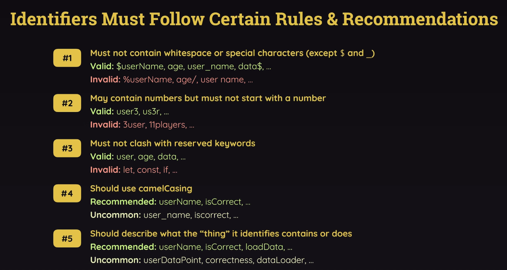

# Javascript

A general review of Javascript

## Sharing Code Blocks: Exports & Imports

Without modules:
  - Global namespace pollution 
    - all functions and variables are attached to the global object. Making nothing private or scope protected
    - Might overwrite each other, and using same function names causes confusion
  - No clear dependencies between files
    - Files must be loaded in the right order
  - Hard to scale or reuse
    - You can't import just part of a file — you load the entire script whether you use one function or ten. This increases page size and load time.


When using __ES Modules__, you can use the `export` and `import` keywords to export and import code blocks.
We need to add `"type":"module"` into our `package.json` file. This is the only way to add modules natively on js.

ES Modules are loaded asynchronously and statically (at compile time). 

ES Modules are async because loading and evaluating modules actually returns a promise. 
Statically, modules must be loaded before they can be used. So they have to be used in the beginning. This enables optimizations like tree shaking and preloading. 

Default exports mean we dont need to destructure it when we import, and we can give it any name we want.
```js
const add = (x, y) => {
  return x + y;
}

export { add }; //named export; you can export multiple function, separated by commas
export default add; //default export; you can only export one function
export default { add }; //named export default; you can export multiple function, separated by commas

import add from './add'; // import
import {add as addAlias} from './add'; // using aliases / renaming
import * as addAll from './add'; // import all as an object
import defaultExport, {add} from './add'; // import default and named export together
import defaultExport, * as addAll from './add'; // import default and all together
```

With __CommonJS__, you can use the `module.exports` keyword to export code blocks and `require` to import them.  

CommonJS is a Node.js environment specific module system. 

CommonJs is loaded synchronously and dynamically (at runtime). This can potentially block execution for larger modules and slow down performance.

Since its synchronous, modules must be loaded, parsed, and evaluated before they can be used and the code can move on to the next line.  

CommonJS is dynamic because you can call `require()` anywhere in the file, including inside functions, conditionals, and loops. It doesnt need to be at the top of the file, and `require()` is really just a function call. This can be useful if you want to reduce start up time or a module is expensive to load, but you still need to use it way later. 

```js
const add = (x, y) => {
  return x + y;
}

module.exports = add; //default export; you can only export one function
module.exports = { add }; //named export; you can export multiple function, separated by commas
const add = require('./add'); // import
const { add : addAlias } = require('./add'); // import using aliases with objects
```

## Variables 

Variables are always camelCase. 



Variables with __var__ are global scoped, unless its placed inside a function, then it becomes function scoped. The variables themselves are hoisted to the top of the scope (not its value) and is `undefined` initially.  
Variables with __let__ and __const__ are block scoped (if, for, anything with brackets). They are not hoisted and throw a reference error.

## Functions

Functions are always camelCase. Functions are always locally scoped.

__Function Declarations__ are always hoisted to the top of their scope. `function add(x, y) {...}`  
__Function Expressions / Arrow Functions__ are not hoisted, `var` keyword rules apply here as well, so only var is hoisted. `var add = function(x, y) {...}`

On __Arrow Functions__ the `this` keyword refers to the parent scope. If your function is only returning a single value, you may remove the wrapping curly braces and the `return` keyword, but returning an object must be wrapped in parenthesis instead. If theres more than one line, you must keep the curly braces. 

## Array Methods

## Destructuring

```js
// Array Destructuring
const [a, b, c] = [1, 2, 3];
console.log(a, b, c); // 1, 2, 3

// Object Destructuring; must use the same name as the objects' keys or use aliases with syntax `key: alias`
const {a, b, c : alias} = {a: 1, b: 2, c: 3};
console.log(a, b, alias); // 1, 2, 3

// If we know objects can be destructured, then when using objects as parameters, we can also destructure them inside the parameters, to get their values directly. This reduces the need for dot notation when accessing an object's properties and/or saves us some steps of destructuring them later. 

function add(object){
  return object.a + object.b; // let {a, b} = object; return a + b; 
}

function add({a, b}) {
  return a + b;
}
```

## Spread Operators

Pull out elements of an array or object and spread them out into a new array or object.

```js
//Spread arrays
const arr1 = [1, 2, 3];
const arr2 = [4, 5, 6];
const arr3 = [...arr1, ...arr2];
console.log(arr3); // [1, 2, 3, 4, 5, 6] 

//Spread objects
const obj1 = {a: 1, b: 2};
const obj2 = {c: 3, d: 4};
const obj3 = {...obj1, ...obj2};
console.log(obj3); // {a: 1, b: 2, c: 3, d: 4} 
```

## Control Flow / Structures

## DOM Manipulation

## Utilizing Functions as Values

When using functions as values, we can use them as parameters, return values, or even create new functions with them. 

Its important to know that using functions with the parenthesis will execute the function immediately, but using them without the parenthesis will define the function and execute it at a later time.

An anonymous function is also viable as a value, and doesnt execute immediately. If you did though, you would use an IIFE (Immediately Invoked Function Expression) to execute the function immediately, which is useful for creating private variables.

```js

function handleTimeout(callback) {
  setTimeout(callback, 1000);
}
// notice callback does not have the parenthesis

```

We can also simulate our own function that calls another function at a later time. We pass in the function as a value, and later execute the function. 

```js
function greet(greetFn){
  greetFn(); //call to execute the function
}
greet(() => console.log(`here is my code`));

```

## Reference vs Primitive

Primitive types are passed by value, Reference (Non-primitive) types like arrays, objects, functions are passed by reference. 

Reference types allow change of value, but not reassignment.  Each reference will have its own address memory, so no two objects are the same, unless they're pointed to the same address. 

If there is a no reference to memory, then garbage collector will remove the variables. 

