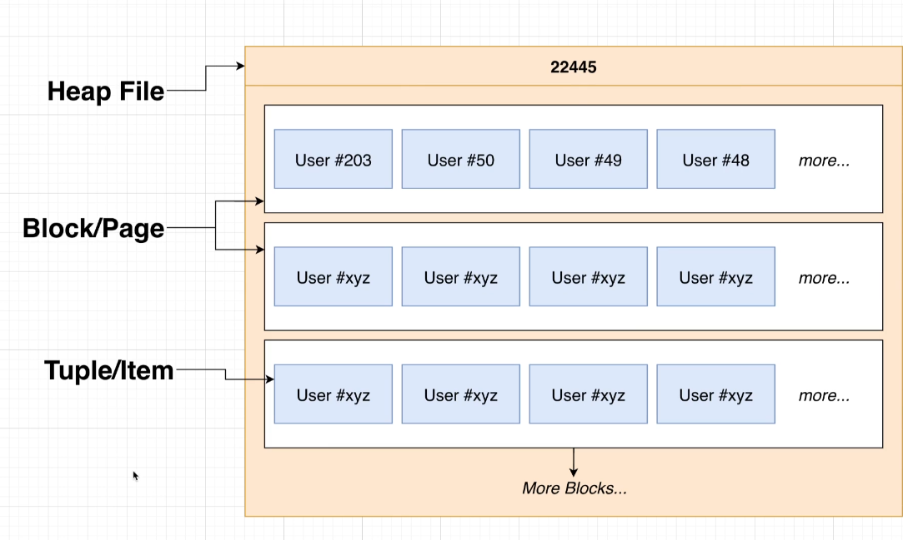
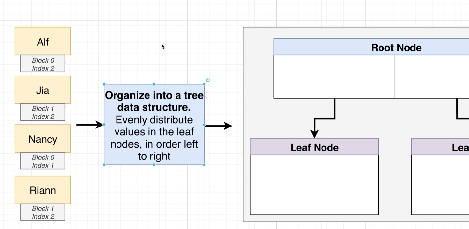
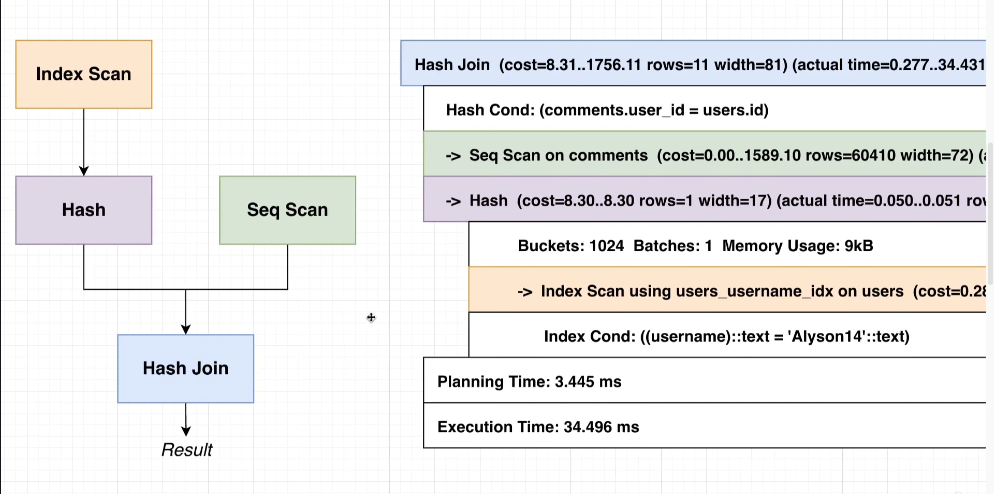
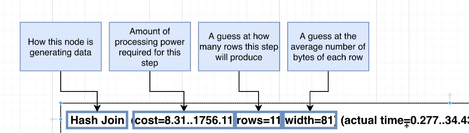

# Postgres (PostgreSQL)

Postgres is one of the most popular open source relational databases. It is a SQL database engine that supports ACID transactions and is written in C. It is also known as PostgreSQL.

PostgreSQL is the database server itself. When you install PostgreSQL locally or run it in a Docker container, you're setting up a database server that listens for connections (e.g., on localhost:5432).

PostgreSQL does not come with a graphical user interface (GUI) for managing the database. Instead, you use tools like:  
**pgAdmin**: A web-based GUI for managing PostgreSQL databases (similar to MongoDB Compass for MongoDB).  
**psql**: A command-line tool for interacting with PostgreSQL databases.

**MongoDB Compass:**  
MongoDB Compass is a GUI tool for managing MongoDB databases. It connects to a MongoDB server, which can be running locally, in a Docker container, or on a remote cloud service like MongoDB Atlas. PostgreSQL Does Not Have a Built-In Remote Cloud Service.
MongoDB Compass is not the database server itself—it's just a client application for interacting with the database.

**Self-Hosted PostgreSQL:**

Install PostgreSQL on your local machine, a virtual machine, or a Docker container.
Manage the database yourself, including backups, scaling, and security.

**Cloud-Hosted PostgreSQL:**

Use a cloud provider to host your PostgreSQL database. Popular options include:

- Amazon RDS for PostgreSQL (AWS)
- Google Cloud SQL for PostgreSQL (GCP)
- Azure Database for PostgreSQL (Microsoft Azure)
- Heroku Postgres (Heroku)

**Third-Party Services:**
Services like ElephantSQL or Supabase provide managed PostgreSQL hosting with features like backups, scaling, and monitoring.

## Overview Directory

├── [Keys](#keys)  
├── [Relationships](#relationships)  
├── [Operators](#operators)  
├── [Functions](#functions)  
├── [Data Types](#data-types)  
├── [Queries](#queries--actions)  
├── [Constraints](#constraints)  
├── [Aggregate Functions](#aggregate-function)  
├── [Row Level Functions](#row-level-functions)  
├── [Execution Order](#sql-query-execution-order)  
├── [Validation](#validation)  
├── [Postgres Snippets](#postgres-examples)  
├── [pgAdmin](#pgadmin)  
└── [pg library](#pg-library)

Important questions to ask?

1. What kind of thing are we storing?
2. What properties does it have?
3. Type of data for each of those properties?

Postgres uses tables to store data.

---

## ==Keys==

**Primary Keys** - Identifies unique rows in a table.  
**Foreign Keys** - Identifies/references unique rows in another table. It helps us connect the data between tables. Usually 'many' side gets the foreign key column of the other tables. Foreign keys are always checked for consistency, and will return an error if they are not consistent (foreign key constraints). Any action will be interrupted until the foreign key is consistent. If we dont have a foreign key ready yet, the null value can be used to indicate this relationship does not exist yet. You can specify delete behavior using

### When we try to delete a row that has a foreign key:

1. **DELETE RESTRICT** => Throws an error.
2. **DELETE NO ACTION** => Throw an error.
3. **DELETE CASCADE** => Delete the row that has a foreign key.
4. **DELETE SET NULL** => Set the foreign key column to null.
5. **DELETE SET DEFAULT** => Set the foreign key column to the default value, if one is provided.

Data Consistency - Data is consistent and line up with each other.

---

## ==Relationships==

| Relationships | Description  |
| ------------- | ------------ |
| 1:1           | One-to-one   |
| 1:N           | One-to-many  |
| N:1           | Many-to-one  |
| N:N           | Many-to-many |

### Schema Designs

├── [Join Table](#join-tables)  
├── [Polymorphic Association](#polymorphic-association)  
├── [Single Table Inheritance](#single-table-inheritance-multiple-foreign-key-columns)  
└── [Concrete Table Inheritance (Association Table per Model)](#concrete-table-inheritance-join-table-per-association)

In general, we never want to store derived data (data that can be calculated through queries)

What should you choose? Well if specificity matters, then go for concrete table inheritance of association tables. Between those two, If these specifics are even more specified, then go for association table per model.

Something like likes for both posts or comments, is more appropriate with concrete table inheritance. Reaction type liking is more appropriate for association table per model since those likes are more specific and different and warrant multiple tables.

We should consider other factors like:

- **optimizing** - as association table per model is more performant, because we can isolate the specific table for optimizing, instead of running queries on a cumulative table. Association table per model offers more flexible changes at the table level, since each type has its own and changes wont affect the other types.

- **complexity of queries** - if we only require a very general query pertaining to all types, then go for polymorphic association. Otherwise, go for concrete table inheritance of association tables. An example is hashtags, which is really only used in social media apps under a search feature. For instagram in particular, we need to separate the model for posts, from comments and users, since its search feature is focused on hashtags for posts. This implies concrete table inheritance for posts only, but since its the only one with queries being needed, its really just the single table being created.

### Join Tables

**AKA Junction Tables or Association Tables**

A table that connects two tables together. It is used to represent many-to-many relationships.

Join tables is often used to **reduce the number of queries and improve performance**. If we have a many-to-many relationship, we can often repeat the same data in multiple tables. Instead of doing a query for each table, we can join the tables together and get the data we need in a single query. This can be done using a join table.

| **hashtags** |
| ------------ |

| id  | title  |
| --- | ------ |
| 1   | cat    |
| 2   | dog    |
| 3   | catdog |

| **hashtags_posts** |
| ------------------ |

<!-- storing integers for hashtags is more space efficient than storing strings, esp for repeated data. -->

| id  | hashtag_id | post_id |
| --- | ---------- | ------- |
| 1   | 1          | 1       |
| 2   | 2          | 1       |
| 3   | 2          | 2       |

| **posts** |
| --------- |

| id  | url | user_id |
| --- | --- | ------- |
| 1   | ... | 1       |
| 2   | ... | 1       |
| 3   | ... | 2       |

### Polymorphic Association

**Polymorphic Association** - One table column can be associated with multiple tables. This method can't use foreign key columns. Instead, it uses a discriminator column. This method is an alternative to using many foreign key columns in one table, assuming those foreign key columns all reference the same column.

However, its not recommended in data designs like postgres which require its foreign key relationships to exist beforehand to ensure data consistency, so its not common to see. This design is however common with **Ruby on Rails** for example.

#### A polymorphic table will typically have:

**target_id** – the primary key of the associated record; no longer a foreign key column since it can reference multiple tables

**target_type** – the name of the associated table/model

✅ Pros:

- Reduces duplication (no need for post_likes, comment_likes, etc.)
- Flexible and extensible

❌ Cons:

- Harder to enforce foreign key constraints, which can lead to data inconsistency
- Queries can get more complex, causing a performance penalty.

_`the likes table here showcases a liked_type for posts and comments, because both those tables have likes functionality`_
| **likes** |
|---------------------------------------|

| id  | user_id | liked_id | liked_type |
| --- | ------- | -------- | ---------- |
| 1   | 3       | 2        | post       |
| 2   | 3       | 1        | comment    |
| 3   | 4       | 2        | post       |
| 4   | 4       | 1        | comment    |

### Single Table Inheritance (Multiple Foreign Key Columns)

We implement multiple separate foreign key columns instead, and have the rest be filled with nulls to represent the type for that row.

| **likes** |
| --------- |

| id  | user_id | post_id | comment_id |
| --- | ------- | ------- | ---------- |
| 1   | 3       | 2       | NULL       |
| 2   | 3       | NULL    | 1          |
| 3   | 4       | 2       | NULL       |
| 4   | 4       | 1       | NULL       |

❌ Cons:

- Not flexible; What if we allow more types of likes in the future?

To ensure correct data consistency, we need to add a check to ensure that only one of the columns is not null.

```sql

CREATE TABLE likes (
  id SERIAL PRIMARY KEY,
  user_id INTEGER NOT NULL,
  post_id INTEGER,
  comment_id INTEGER,
  CHECK (post_id IS NOT NULL OR comment_id IS NOT NULL)
);

-- OR

CREATE TABLE likes (
  id SERIAL PRIMARY KEY,
  user_id INTEGER NOT NULL,
  post_id INTEGER REFERENCES posts(id),
  comment_id INTEGER REFERENCES comments(id),
  CHECK (COALESCE((post_id)::BOOLEAN::INTEGER, 0) + COALESCE((comment_id)::BOOLEAN::INTEGER, 0) = 1)
)

-- OR

ALTER TABLE likes
ADD CHECK (COALESCE((post_id)::BOOLEAN::INTEGER, 0) + COALESCE((comment_id)::BOOLEAN::INTEGER, 0) = 1);

-- keep in mind, type casting a null value to boolean or integer will result in null. But if you type cast a non-null value to boolean or integer, it will result in 1.
---

```

### Concrete Table Inheritance (Join Table per Association)

We can create a join table per association. This is the most common method for creating a many-to-many relationship.

| posts_likes |
| ----------- |

| id  | user_id | post_id |
| --- | ------- | ------- |
| 1   | 3       | 2       |
| 2   | 3       | 1       |
| 3   | 4       | 2       |
| 4   | 4       | 1       |

| comments_likes |
| -------------- |

| id  | user_id | comment_id |
| --- | ------- | ---------- |
| 1   | 3       | 2          |
| 2   | 3       | 1          |
| 3   | 4       | 2          |
| 4   | 4       | 1          |

So if users can like posts and comments. We can create a separate table for each association.

✅ Pros:

- Allows us to set specific constraints on every association, compared to the limitations of using one table for all associations. It also allows us to easily branch those association tables, into other nested association tables.

❌ Cons:

- Not flexible; What if we allow more types of likes in the future? We would need to create more association tables.
- If you want the total number of likes involving posts and comments, you'd need to do a union or a view, which is more complex.

```sql
-- union of post_likes and comment_likes to get the total number of likes
SELECT COUNT(*) AS total_likes
FROM (
  SELECT user_id FROM post_likes
  UNION ALL
  SELECT user_id FROM comment_likes
) AS all_likes;

-- sum the count from each query
SELECT
  (SELECT COUNT(*) FROM post_likes) +
  (SELECT COUNT(*) FROM comment_likes) AS total_likes;

-- create a view (template)
CREATE VIEW all_likes AS
SELECT user_id, post_id AS liked_item_id, 'post' AS liked_type FROM post_likes
UNION ALL
SELECT user_id, comment_id AS liked_item_id, 'comment' AS liked_type FROM comment_likes;

SELECT COUNT(*) FROM all_likes;
```

## ==Operators==

| Math Operators | Description    |
| -------------- | -------------- |
| +              | Addition       |
| -              | Subtraction    |
| \*             | Multiplication |
| /              | Division       |
| ^              | exponent       |
| \|/            | square root    |
| @              | absolute       |
| %              | modulus        |

| Comparison Operators | Description                                                  |
| -------------------- | ------------------------------------------------------------ |
| =                    | equality                                                     |
| !=                   | not equal                                                    |
| <>                   | not equal                                                    |
| >                    | greater than                                                 |
| <                    | less than                                                    |
| >=                   | greater than or equal to                                     |
| <=                   | less than or equal to                                        |
|                      |                                                              |
| BETWEEN              | value between two other values                               |
| IN()                 | value is in a list of values                                 |
| EXISTS               | checks if a value exists, performs faster than IN()          |
| AND                  | logical AND                                                  |
| OR                   | logical OR                                                   |
| NOT                  | logical NOT                                                  |
| ALL \*               | logical ALL                                                  |
| SOME / ANY \*        | Compares a value against ANY (at least one) value in a list. |

\* ALL/SOME/ANY require a comparison operator preceding them.

## ==Functions==

| String Operators / Functions | Description                                           |
| ---------------------------- | ----------------------------------------------------- |
| \|\|                         | Concatenation                                         |
| CONCAT()                     | Concatenation                                         |
| LOWER()                      | Convert to lowercase string                           |
| UPPER()                      | Convert to uppercase string                           |
| SUBSTRING()                  | Extract a substring from a string                     |
| LENGTH()                     | Get the length of a string                            |
| REPLACE()                    | Replace a substring in a string                       |
| TRIM()                       | Remove leading and trailing whitespace from a string  |
| LTRIM()                      | Remove leading whitespace from a string               |
| RTRIM()                      | Remove trailing whitespace from a string              |
| INSTR()                      | Find the position of a substring in a string          |
| LEFT()                       | Get the leftmost characters of a string               |
| RIGHT()                      | Get the rightmost characters of a string              |
| REPEAT()                     | Repeat a string a certain number of times             |
| COALESCE()                   | returns the first non-null value from the list of arg |

---

## ==Data Types==

**General Rules:**

(There is no performance difference)

- id column of any table is SERIAL.

### Integer

- Storing a number without decimals is INTEGER.
- Storing a number with decimals and it needs to be exact is NUMERIC.
- Storing a number with decimals and the decimal doesn't matter is DOUBLE PRECISION.

### Boolean

- `True, 'yes', on, 1, 't', 'y'` = true.
- `False, 'no', off, 0, 'f', 'n'` = false
- `NULL` = null

### Time

We can perform operations on time data types.

- `TIME` = any time format w/o timezone, also accepts am or pm
- `TIME WITH TIME ZONE` = any time format, also accepts am or pm, must include timezone ex: `01:23:23 AM UTC` outputs `01:23:23+00:00`
- `TIMESTAMP` = any date and time, also accepts am or pm
- `TIMESTAMP WITH TIME ZONE` = any date and time with timezone, also accepts am or pm, must include timezone ex: `NOV 20 1980 01:24 AM PST` outputs `1980-11-20 02:23:00-07`

### Interval

Intervals are especially useful when working or doing calculations with time. We can subtract 1 day from a specific date. You can also perform calculations on the interval itself `SELECT INTERVAL '2 days' - INTERVAL '1 day';` or `SELECT INTERVAL '2 days' * 2;`  
We can also use it in conditions: `SELECT * FROM events WHERE duration > INTERVAL '2 days';`

- `1 day` / `1d` = 1 day
- `1 hour` = 1 hour
- `1d 1m 1s` = 1 day 1 minute 1 second

### Null

Null is not an actual value, as it represents an unknown value. So equality statements do not work with null. Use IS NULL to check for null values.

| Column Data Types                      | Description                                                                                     |
| -------------------------------------- | ----------------------------------------------------------------------------------------------- |
| SMALLSERIAL                            | A number that is automatically incremented. 1 to 32767                                          |
| SERIAL                                 | A number that is automatically incremented. 1 to 2147483647                                     |
| BIGSERIAL                              | A number that is automatically incremented. 1 to 9223372036854775807                            |
| CHAR(length of fixed string: req)      | A fixed-length string. Characters will include spaces and pad if needed                         |
| VARCHAR(length of max string: opt)     | A variable-length string. Stores any or up to the length if specified, otherwise acts like TEXT |
| TEXT                                   | A variable-length string. Stores any length, with no length limit                               |
| SMALLINT                               | A number. -32768 to +32767                                                                      |
| [INTEGER](#integer)                    | A number. Limits are ~ 2 billion for positive and negative numbers.                             |
| BIGINT                                 | A number. -9223372036854775808 to +9223372036854775807                                          |
| [BOOLEAN](#boolean)                    | A true or false value.                                                                          |
| DATE                                   | A date. Accepts any date format.                                                                |
| [TIME / TIME WITHOUT TIME ZONE](#time) | A time. Accepts any time format w/o timezone.                                                   |
| TIME WITH TIME ZONE                    | A time with timezone. Accepts any time format.                                                  |
| TIMESTAMP                              | A date and time.                                                                                |
| TIMESTAMP WITH TIME ZONE               | A date and time with timezone.                                                                  |
| INTERVAL                               | A time interval. Create a duration of time                                                      |
| NUMERIC / DECIMAL                      | 131072 digits before the decimal point, 16383 after                                             |
| REAL                                   | 1E-37 to 1E+37, minimum of 6 decimal digits of precision.                                       |
| DOUBLE PRECISION                       | 1E-307 to 1E+308, minimum of 15 decimal digits of precision.                                    |
| FLOAT                                  | Same as REAL or DOUBLE PRECISION                                                                |
| DEFAULT <default value>                | Set a default value for your data type after setting a data type, null if not set.              |

---

## ==Queries / Actions==

| SQL Queries                              | Description                                                                                               |
| ---------------------------------------- | --------------------------------------------------------------------------------------------------------- |
| CREATE                                   | Create a database.                                                                                        |
| CREATE TABLE                             | Create a table in a database.                                                                             |
| CREATE INDEX                             | Create an index in a database.                                                                            |
| CREATE VIEW                              | Create a view in a database.                                                                              |
| CREATE FUNCTION                          | Create a function in a database.                                                                          |
| CREATE TRIGGER                           | Create a trigger in a database.                                                                           |
| CREATE DOMAIN                            | Create a domain in a database.                                                                            |
| CREATE ROLE                              | Create a role in a database.                                                                              |
| CREATE SCHEMA                            | Create a schema in a database.                                                                            |
| CREATE SEQUENCE                          | Create a sequence in a database.                                                                          |
| ALTER ...                                | Alter a part of a database.                                                                               |
| ALTER TABLE                              | Alter a table in a database.                                                                              |
| ALTER COLUMN                             | Alter a column in a table.                                                                                |
| ALTER INDEX                              | Alter an index in a database.                                                                             |
| ALTER VIEW                               | Alter a view in a database.                                                                               |
| ALTER FUNCTION                           | Alter a function in a database.                                                                           |
| ALTER TRIGGER                            | Alter a trigger in a database.                                                                            |
| ALTER DOMAIN                             | Alter a domain in a database.                                                                             |
| ALTER ROLE                               | Alter a role in a database.                                                                               |
| ALTER SCHEMA                             | Alter a schema in a database.                                                                             |
| ALTER SEQUENCE                           | Alter a sequence in a database.                                                                           |
| DROP ...                                 | Delete a part of a database.                                                                              |
| DROP TABLE                               | Delete a database.                                                                                        |
| AS                                       | Temporarily Alias/name a database, table, column, row, etc. Keyword itself is optional                    |
| RENAME TO                                | Rename a database (used with ALTER)                                                                       |
| RENAME <target> TO                       | Rename a table, column, row, etc. (used with ALTER)                                                       |
| ───────────────                          | ────────────────────────────────────────                                                                  |
| SELECT                                   | Retrieve data from a database.                                                                            |
| FROM                                     | Specify the table or tables to select.                                                                    |
| JOINS ... ON                             | Join data from multiple tables and used when needed to find data from multiple sources.                   |
| WHERE                                    | Filter data/rows based on a condition.                                                                    |
| ───────────────                          | ────────────────────────────────────────                                                                  |
| INSERT                                   | Insert data into a database.                                                                              |
| INTO                                     | Specify the table to insert data into.                                                                    |
| VALUES                                   | Specify the data to insert.                                                                               |
| ───────────────                          | ────────────────────────────────────────                                                                  |
| UPDATE                                   | Update data in a database.                                                                                |
| SET                                      | Set a value in a database.                                                                                |
| ───────────────                          | ────────────────────────────────────────                                                                  |
| DELETE                                   | Delete data from a database.                                                                              |
| ───────────────                          | ────────────────────────────────────────                                                                  |
| [JOIN / INNER JOIN](#joins)              | Join data from multiple tables that share a common column. This is known as an inner join.                |
| LEFT JOIN / LEFT OUTER JOIN              | Join all the data from the left table and the matching data from the right table.                         |
| RIGHT JOIN / RIGHT OUTER JOIN            | Join all the data from the right table and the matching data from the left table.                         |
| FULL JOIN / FULL OUTER JOIN              | Join all the data from the left and right tables, regardless of matching data.                            |
| ON                                       | Specify the condition for joining tables / matching data                                                  |
| ───────────────                          | ────────────────────────────────────────                                                                  |
| [AGGREGATION](#grouping-and-aggregating) | Group data and perform operations on it through SELECT queries. (most, average, least, etc...)            |
| [GROUP BY](#grouping-and-aggregating)    | Group data based on one or more columns. It merges multiple rows together                                 |
| GROUP BY ... HAVING                      | Filter the grouped data                                                                                   |
| DISTINCT                                 | Remove duplicate rows. Always placed after the SELECT clause.                                             |
| ───────────────                          | ────────────────────────────────────────                                                                  |
| [ORDER BY](#order-by)                    | Sort data based on one or more columns.                                                                   |
| DESC                                     | Sort data in descending order.                                                                            |
| ASC                                      | Sort data in ascending order. (this is default)                                                           |
| NULLS FIRST                              | Sort NULL values first.                                                                                   |
| NULLS LAST                               | Sort NULL values last.                                                                                    |
| ───────────────                          | ────────────────────────────────────────                                                                  |
| [LIMIT](#limits-and-offsets)             | Limit the number of rows returned.                                                                        |
| [OFFSET](#limits-and-offsets)            | Skip the first n rows in the result set.                                                                  |
| FETCH                                    | Fetch the first n rows in the result set.                                                                 |
| ───────────────                          | ────────────────────────────────────────                                                                  |
| [UNION](#unions)                         | Combine the result sets / rows of two or more SELECT statements.                                          |
| UNION ALL                                | Combine the result sets / rows of two or more SELECT statements without removing duplicates.              |
| INTERSECT                                | Return the rows that are common to all SELECT statements.                                                 |
| INTERSECT ALL                            | Return the rows that are common to all SELECT statements without removing duplicates.                     |
| EXCEPT                                   | Removes commonalities between the queries, showing only unique values from the first query                |
| EXCEPT ALL                               | Return the rows that are only unique to the first SELECT statement without removing duplicates.           |
| ───────────────                          | ────────────────────────────────────────                                                                  |
| [subqueries](#subqueries)                | Execute a SELECT statement within a SELECT statement with parentheses.                                    |
| ───────────────                          | ────────────────────────────────────────                                                                  |
| CASE WHEN ... THEN ... ELSE ... END      | Perform a conditional statement.                                                                          |
| WITH ... AS ...                          | Create a named subquery with a temporary table. Also known as a common table expression (CTE).            |
| WHERE ... LIKE <pattern>                 | Match a pattern.                                                                                          |
| ───────────────                          | ────────────────────────────────────────                                                                  |
| [BEGIN](#transactions)                   | starts a transaction                                                                                      |
| COMMIT                                   | commits a transaction (finalizes and saves)                                                               |
| ROLLBACK                                 | undo changes in a transaction if anything fails                                                           |
| SAVEPOINT                                | create a named checkpoint in a transaction                                                                |
| RELEASE                                  | release a named checkpoint in a transaction                                                               |
| ───────────────                          | ────────────────────────────────────────                                                                  |
| [EXPLAIN ANALYZE](#explain--analyze) ...                      | Explain and analyze a query. It gives us more information like: query plan, planning and execution times. |

---

### ==Constraints==

To find your constraints of a table, use pgAdmin to inspect those constraints or this query:

```sql
SELECT
    conname AS constraint_name,
    contype AS constraint_type,
    pg_get_constraintdef(c.oid) AS definition
FROM
    pg_constraint c
JOIN
    pg_namespace n ON n.oid = c.connamespace
JOIN
    pg_class t ON t.oid = c.conrelid
WHERE
    t.relname = 'table_name';

-- or go on psql tool with this query:
\d+ <table_name>
```

**No Constraint** : It doesn't matter if the value exist.  
**NOT NULL** : We always want to provide a value  
**NOT NULL + DEFAULT** : We always want a value, but its optional.

```sql
CHECK((value2 IS NULL) = (value2 IS NULL))
```

: Both values are required to be provided or not provided. If one value is given, the other is required.

```sql
CHECK(COALESCE(value1, value2) IS NOT NULL)
```

: Either value1 or value2 must have a value, but there is no hard check for both having a value.

```sql
CHECK(
  COALESCE((value1)::BOOLEAN::INTEGER, 0)
  +
  COALESCE((value2)::BOOLEAN::INTEGER, 0)
  = 1
)
```

```sql
CHECK((value1 IS NULL) != (value2 IS NULL))
-- does not scale beyond 2 values
```

```sql
CHECK (
  (value1 IS NOT NULL)::int +
  (value2 IS NOT NULL)::int +
  (value3 IS NOT NULL)::int = 1
)
```

```sql
-- dropping a not null constraint on a column
ALTER TABLE pets
ALTER COLUMN name DROP NOT NULL;

```

: Either value1 or value2 must be not null

| SQL CONSTRAINTS                   | Description                                                                                     |
| --------------------------------- | ----------------------------------------------------------------------------------------------- |
| PRIMARY KEY                       | A unique identifier for each row in a table. (Also increases performance when looking up by PK) |
| REFERENCES <table(col)>           | A foreign key, which is a reference to another table in the database.                           |
| ON DELETE ...                     | Specify the action to take when deleting                                                        |
| ON DELETE RESTRICT                | Prevent deletion of the referenced row with foreign key                                         |
| ON DELETE CASCADE                 | Delete the row if it has a foreign key                                                          |
| ON DELETE SET NULL                | Set the foreign key to NULL                                                                     |
| ON DELETE SET DEFAULT             | Set the foreign key to a custom DEFAULT value                                                   |
| NOT NULL                          | Prevent NULL values in the column. will error if existing null values or no values given        |
| DEFAULT                           | Set a default value for the column                                                              |
| SET DEFAULT                       | Set a default value for the column with ALTER                                                   |
| [UNIQUE](#unique)                 | Prevent duplicate values in the column                                                          |
| ADD UNIQUE                        | Add a unique value for the column with ALTER                                                    |
| PRIMARY KEY                       | Set a unique value for the column                                                               |
| [CHECK](#check) (condition)       | Perform a conditional statement                                                                 |
| ADD CHECK                         | Add a conditional statement with ALTER                                                          |
| DROP CONSTRAINT <constraint_name> | Remove a constraint from the table with ALTER                                                   |

---

### ==[Aggregate Functions](#grouping-and-aggregating)== <a id="aggregate-function"></a>

Aggregate Functions are functions that are applied to a group of data in columns. It reduces rows to a single row and therefore take in columns.

| Aggregate Functions                 | Description                                                  |
| ----------------------------------- | ------------------------------------------------------------ |
| COUNT()                             | Count the number of rows in a table. Does not work with NULL |
| SUM()                               | Sum the values in a column.                                  |
| AVG()                               | Calculate the average value in a column.                     |
| MIN()                               | Find the minimum value in a column.                          |
| MAX()                               | Find the maximum value in a column.                          |
| STDDEV()                            | Calculate the standard deviation of a column.                |
| VAR()                               | Calculate the variance of a column.                          |
| STRING_AGG (column name, delimiter) | Aggregate data into a single string.                         |
| ARRAY_AGG (column name)             | Aggregate data into an array.                                |

---

### ==Row Level Functions==

Row Level Functions are functions that are applied to each row of data. It reads a single row at a time.

| Row Level Functions               | Description                                                 |
| --------------------------------- | ----------------------------------------------------------- |
| [GREATEST()](#greatest-and-least) | Returns the largest value from a list of values in the row  |
| LEAST()                           | Returns the smallest value from a list of values in the row |

---

### ==SQL Query Execution Order==

When interacting with a database, theres an order that SQL follows:  
1️⃣ FROM → Determine the source tables  
2️⃣ JOIN / ON → Apply joins between tables (ON condition comes before the JOIN keyword)  
3️⃣ WHERE → Filter rows after joins  
4️⃣ GROUP BY → Group rows together (Aggregate functions are applied here after grouping)  
5️⃣ HAVING → Filter groups  
6️⃣ SELECT → Choose columns to return  
7️⃣ DISTINCT → Remove duplicate rows  
8️⃣ ORDER BY → Sort the final result  
9️⃣ LIMIT / OFFSET → Limit the number of rows (by convention, limit is placed before offset)

**Keywords** - tell the database what we want to do. Its always written in CAPITAL LETTERS.  
**Identifiers** - tell the database what this is called. Its always written in lowercase.

### SQL Query Processing Steps / Pipeline:

1. Parser - ensure we have valid syntax. Builds a query tree, which breaks apart the query into its component parts/steps that can be understood by the database
2. Rewriter - rewrite the query to make it more efficient. Usually it applies views to the query tree to make it more efficient.
3. Planner - determine the best execution plan for the query. It optimizes the query to make it more efficient.
   - `EXPLAIN` - builds up the execution plan for the query and displays infor about it.
   - `EXPLAIN ANALYZE` - builds up the execution plan for the query, runs it, and displays info about it.
4. Executor - execute the query on the database.

---

## ==Validation==

| Web Server                                      | Database                                                                              |
| ----------------------------------------------- | ------------------------------------------------------------------------------------- |
| Easier to express more complex validation       | Validation still applied even if you connect with a different client                  |
| Far easier to apply new validation rules        | Guaranteed that validation is always applied at the database level (through a schema) |
| Many libraryies handle validation automatically | Can only apply new validation rules if all existing rows satisfy the rule             |

**Web Server:**

- ✅ **Easier to express more complex validation**  
  Web servers can use JavaScript logic or validation libraries like Joi, Validator.js, or Express-Validator to enforce complex rules (e.g., password strength, email formats, business logic).

- ✅ **Far easier to apply new validation rules**  
  Validation logic can be updated without affecting existing data in the database.  
  Example: If you want to enforce a stronger password policy, you can just update the validation logic in Express without modifying the database.

- ✅ **Many libraries handle validation automatically**  
  Example: If you're using Mongoose (for MongoDB) or Sequelize (for SQL), they have built-in validation rules for schemas, making it easier to enforce consistency.

- ❌ Validation at the web server level only works if every client follows the API rules.

- ❌ If someone connects directly to the database (e.g., through psql or another API), they could bypass these checks.

**Database:**

Database-level validation ensures data integrity, even if a client bypasses the web server.

- ✅ **Validation is always applied**  
  If someone directly connects to PostgreSQL using psql, pgAdmin, or another tool, the database enforces constraints.
- ✅ **Guaranteed schema enforcement**  
  Constraints like NOT NULL, UNIQUE, CHECK, and FOREIGN KEY always apply, preventing bad data from entering the database. Consistent data types and the domain like ranges also fall into this category.
- ✅ **Ensures consistency across multiple clients**  
  Even if multiple services write to the same database, all of them must follow database constraints.

- ❌ **Applying new validation rules is harder**  
  If you add a new validation rule on an existing table, all existing rows must comply before the change is allowed.

- ❌ **Complex validations are harder**  
  PostgreSQL constraints work well for basic validation (e.g., NOT NULL, CHECK), but complex rules (like "password must contain a special character") are better handled at the web server level.

**Best practice: <ins>Use both</ins>.**

**Web Server (Express/Node.js)**: Handles business logic and complex validations.

**Database (PostgreSQL)**: Ensures data integrity and prevents bad data at the lowest level.

---

## ==Postgres Examples==

```sql

-- keywords  identifiers
CREATE TABLE cities(
  -- column name data type
  name VARCHAR(50),
  country VARCHAR(50),
  population INTEGER,
  area INTEGER
);

-- inserting data to our table
INSERT INTO cities (name, country, population, area)
VALUES
  ('Tokyo', 'Japan', 38505000, 8223),
  ('Delhi', 'India', 28125000, 2240),
  ('Shanghai', 'China', 21715000, 1628),
  ('Sao Paulo', 'Brazil', 21272000, 9449);

-- retrieving data from our table
SELECT * FROM cities;
SELECT area, name, name, country FROM cities;

-- do some calculation using math operations and use AS to name a new column for it
SELECT name, population/area AS density FROM cities;

-- using || for concatenation and labeling its new column as location.
SELECT name || ' is a city in ' || country AS location FROM cities;

-- using CONCAT() for concatenation and labeling its new column as location.
SELECT UPPER(CONCAT(name, ' is a city in ', country)) AS location FROM cities;

-- using WHERE to filter data
SELECT name, ara FROM cities WHERE area > 4000;

-- using comparison operators
SELECT name, area FROM cities WHERE area BETWEEN 2000 AND 4000;
SELECT name, area FROM cities WHERE name IN ('Delhi', 'Shanghai');
SELECT name, area FROM cities WHERE area NOT IN (3043, 8223) OR name = 'Delhi';
SELECT name, population / area AS population_density FROM cities WHERE population / area > 6000; -- we cannot use population_density for comparison because its not a column name.

--to use the alias column name:

-- 1. Use a Subquery:
-- SELECT name, population_density
-- FROM (
--     SELECT name, population / area AS population_density
--     FROM cities
-- ) subquery
-- WHERE population_density > 6000;

-- 2. Use a CTE (Common Table Expression):
-- WITH city_data AS (
--     SELECT name, population / area AS population_density
--     FROM cities
-- )
-- SELECT name, population_density
-- FROM city_data
-- WHERE population_density > 6000;
```

```sql
-- updating data in our table (update does not return the updated row or our data)
UPDATE cities SET population = 39505000 WHERE name = 'Tokyo';
```

```sql
-- deleting data in our table (delete does not return the deleted row or our data)
DELETE FROM cities WHERE name = 'Tokyo';
```

```sql
-- find the ids of the top five most liked posts
SELECT posts.id
FROM posts
JOIN likes ON posts.id = likes.post_id
GROUP BY posts.id
ORDER BY COUNT(*) DESC
LIMIT 5;
```

### Keys

```sql
-- create table with primary keys
CREATE TABLE users(id SERIAL PRIMARY KEY, name VARCHAR(50));

-- create table with foreign keys and specify delete behavior
CREATE TABLE photos(
  id SERIAL PRIMARY KEY,
  url VARCHAR(200),
  user_id INTEGER REFERENCES users(id) ON DELETE CASCADE
);

-- insert values with foreign keys, they must exist on the foreign key table otherwise place a null value or else there will be an error.
INSERT INTO
  photos (url, user_id)
VALUES
  ('https://one.jpg', 4),
  ('http://two.jpg', 1),
  ('http://25.jpg', 1),
  ('http://36.jpg', NULL),
  ('http://754.jpg', 2),
  ('http://35.jpg', 3),
  ('http://256.jpg', 4);

-- retrieve data with foreign keys
SELECT * FROM photos WHERE user_id = 4;

--depending on delete behavior actions this can produce different outcomes on relational databases
DELETE from users WHERE id = 1;
```

### Joins

All **JOINS** queries will match and fill up the combined corresponding number of rows in our combined tables with null values if there is no matching data. Order will matter for directional joins based on which table is on the left and which table is on the right of the JOIN keyword.

REMEMBER **ON** is the matching condition applied to every row, starting from the left initial table matching to the right. ON essentially orders the rows according to its condition. THIS NOT NOT MEAN **ON** WILL ENFORCE SERIAL ORDERING.

Although **ON** is similar to **WHERE** for filtering data, **WHERE** happens after the **JOIN**, which when dealing with outer joins will turn it into an inner join instead, when it detects **NULL** values for example. Placing the condition on **ON** will retain the unmatched rows with NULL values, due to **ON** being executed first before **JOIN**.

| Feature                     | JOIN                                                     | UNION                                                                   |
| --------------------------- | -------------------------------------------------------- | ----------------------------------------------------------------------- |
| Purpose                     | Combines columns from multiple tables                    | Combines rows from multiple queries                                     |
| When to Use                 | When you need data from related tables with a common key | When you need to merge results from two queries with the same structure |
| Number of Columns in Output | Can be different for each table                          | Must be the same for both queries                                       |
| Duplicates                  | Keeps all matching rows                                  | Removes duplicates unless UNION ALL is used                             |

```sql
--select specifies the columns we want to retrieve from the 3rd imaginary table we created by joining tables. Select determines the order of these columns, if non are specified, then the order is based on the table order stated in the query. Select columns must be unique, and if they are the same name, you must specify the table name with dot notation (if certain libraries are still unable to recognize the difference use the AS keyword to rename a column or even rename a table itself).
SELECT contents, username FROM comments
-- the tables join physically side by side with all the same column names on a 3rd imaginary table.
JOIN users ON users.id = comments.user_id;


-- using a left join to specify the null values in our combined table.
INSERT INTO PHOTOS (url, user_id)
VALUES ('https://null.jpg', NULL),

SELECT url, username
FROM PHOTOS
LEFT JOIN users ON users.id = photos.user_id;

-- using a full join
INSERT INTO USERS (username)
VALUES ('Nicole');

SELECT url, username
FROM PHOTOS
FULL JOIN users ON users.id = photos.user_id;

-- using WHERE to filter data on our JOINed table, we are looking for the user that commented on its own photo
SELECT url, contents
FROM comments
JOIN photos ON photos.id = comments.photo_id
WHERE comments.user_id = photos.user_id;

-- using a three way join to combine 3 tables, we use a join condition so theres no need to use a WHERE for our use case
-- use case is were trying to find the user that commented on their own photo and find their username.
SELECT url, contents, username
FROM comments
JOIN photos ON photos.id = comments.photo_id
JOIN users ON users.id = comments.user_id AND users.id = photos.user_id;
```

### Grouping and Aggregating

**Grouping** is a way to combine data from multiple rows into a single row.

Grouping names unique values as its own rows (buckets), and reorders the data to be grouped under these buckets. We can only select the newly made GROUP BY column names in our SELECT statement, any other will give an error or we can select the column produced by an aggregate function.

**Aggregation** is a way to combine data from multiple rows into a single value.
We can use the following [aggregate functions](#aggregate-function).

```sql
-- using group by to get grouped data based on user_id and aggregate to find the total count of id within the grouped data.
-- Useful for finding a total number of something a user has done for example.
-- We use COUNT(*) to count the number of rows in our table more accurately, than relying on the column which might have null values.
SELECT user_id, COUNT(*) AS num_comments_created
FROM comments
GROUP BY user_id;

-- using aggregate functions on select which produces a column with the name of the aggregate function
SELECT MIN(user_id) FROM comments;

-- Find the number of comments for each photo (comments has a photo_id foreign key)
SELECT photo_id, COUNT(*)
FROM comments
GROUP BY photo_id;

-- We want to print the author's name and the number of books they have written.
-- Reminder that joining comes first, which creates the combined rows for our conjoined table, which is then grouped and later aggregated by count.
SELECT name, COUNT(*)
FROM books
JOIN authors ON authors.id = books.author_id
GROUP BY name;

-- Find the photos where its photo_id is less than 3 and its total count is greater than 2.
SELECT photo_id, COUNT(*)
FROM comments
WHERE photo_id < 3
GROUP BY photo_id HAVING COUNT(*) > 2;

-- find users where the user has commented on the first 2 photos and the user added more than 2 comments on those photos
SELECT user_id, COUNT(*)
FROM comments
WHERE photo_id = 1 OR photo_id = 2
GROUP BY user_id HAVING COUNT(*) > 2;

-- find users where the user has commented on the first 50 photos and the user has added more than 20 comments on those photos

SELECT user_id, COUNT(*)
FROM comments
WHERE photo_id <= 50 AND photo_id > 0
GROUP BY user_id HAVING COUNT(*) > 20;

-- Given a table of phones, print the names of manufacturers and total revenue (price * units_sold) for all phones.  Only print the manufacturers who have revenue greater than 2,000,000 for all the phones they sold.
SELECT manufacturer, SUM(price * units_sold)
FROM phones
GROUP BY manufacturer HAVING SUM(price * units_sold) > 2000000;
```

### Order By

```sql
-- order by multiple criterias on different columns. If price has the same value, order by weight in descending order
SELECT *
FROM products
ORDER BY price, weight DESC;


```

### Limits and Offsets

```sql
-- these queries are useful for pagination, with offsets that are increased while the limit shows the number of rows to return per page

-- limit the number of rows returned from a query
SELECT *
FROM products
LIMIT 5;

-- offset the number of rows returned from a query
SELECT *
FROM products
OFFSET 5;

-- order and limit to get the first 5 rows but skip the first result
SELECT *
FROM products
ORDER BY price
LIMIT 5
OFFSET 1;
```

### Unions

Although ORDER BY allows us to order by multiple columns, the latter columns are dependent on the previous columns. Unions orders multiple columns by combining 2 or more queries together. Parenthesis is necessary if you have multiple query keywords (ORDER BY, LIMIT, etc.) in the same line, because SQL does not know the order of the keywords or which query it is referring to.

Unions must always have the same number of columns, and data types. If the columns are the same name, they will default to the first query's column(s).

```sql
-- combine 2 or more queries together and order by the combined columns

SELECT manufacturer
FROM phones
WHERE price < 170

UNION

SELECT manufacturer
FROM phones
GROUP BY manufacturer
HAVING COUNT(*) > 2

(
  SELECT *
  FROM products
  ORDER BY price DESC
  LIMIT 4
)
UNION ALL
(
  SELECT *
  FROM products
  ORDER BY price/weight DESC
  LIMIT 4
);

-- remember 'intersect all' implies either queries have duplicates (in itself) in order for the duplicate to show. Show commonalities between the queries.

(
  SELECT *
  FROM products
  ORDER BY price DESC
  LIMIT 4
)
INTERSECT ALL
(
  SELECT *
  FROM products
  ORDER BY price/weight DESC
  LIMIT 4
);

-- except removes commonalities between the queries, showing only unique values from the first query.

(
  SELECT id, name
  FROM products
  ORDER BY price DESC
  LIMIT 4
)
EXCEPT
(
  SELECT id, name
  FROM products
  ORDER BY price/weight DESC
  LIMIT 6
);
```

### Subqueries

Place a query inside another query. You dont need a semicolon for the end of the inner query statement, but instead the end of the overall query statement. Keep in mind, we can insert subqueries anywhere in the query, but we do have to consider what it returns for the query to make sense.

You can always place an alias for your subqueries with the AS keyword outside of the parenthesis, useful if your environment does not support columns with the same name.

Why not use join or union instead?

JOIN combines columns from different tables based on a condition, but you're working within a single table and only need a filtered subset of rows.
UNION is for combining results from multiple queries, but here, you only need to filter rows from one table.

Understanding the shapes of data:

```sql
-- SELECT * FROM orders => many rows, many columns
-- SELECT id FROM orders => Many rows, one column
-- SELECT COUNT(*) FROM orders => Single value (1 row, 1 column)

-- SELECT with no FROM => Single value (1 row, 1 column)
-- ex: SELECT(SELECT MAX(price) FROM products), (SELECT AVG(price) FROM products);

-- FROM statements must always have an alias applied to it. If you dont, you will get an error.

-- JOIN clauses must always have its subquery compatible with the ON clause conditions and must have a table alias applied to it.

-- WHERE clauses is where subqueries are commonly used. Whatever subqueries placed in here must match the corresponding WHERE clause conditions stated. For example, IN operator only takes in one column. Sometimes a JOIN clause can do the same thing were a WHERE clause does. Performance for both are the same.

-- > < >= <= = != <> are all single values
-- IN , NOT IN, >/</>=/<=/=/ <> ALL/SOME/ANY are all single columns

-------------------------

-- example of a subquery
SELECT name, price, price / (SELECT MAX(price) FROM phones) AS price_ratio
FROM phones;

-- example of using single values; make sure structure of data stays consistent.
SELECT *
FROM (SELECT MAX(price) FROM products) AS p;
--find the average number of orders for all users

--method 1
SELECT AVG(order_count)
FROM (
  SELECT user_id, COUNT(*) AS order_count
  FROM orders
  GROUP BY user_id;
) AS p;

--method 2; 2 separate queries
CREATE TEMP TABLE temp_order_counts AS
SELECT user_id, COUNT(*) AS order_count
FROM orders
GROUP BY user_id;

SELECT AVG(order_count)
FROM temp_order_counts;

-- calculate the average price of phones for each manufacturer, then print the highest average price.

SELECT MAX(price) AS max_average_price
FROM
(
    SELECT manufacturer, AVG(price) AS price
    FROM phones
    GROUP BY manufacturer
);


-- join subqueries are not common, and much more easier to deal with than nested subqueries.

-- method 1 ; filters then join
SELECT first_name
FROM users
JOIN (
  SELECT user_id
  FROM orders
  WHERE product_id = 3
) AS o
ON users.id = o.user_id;

-- method 2 ; join then filters
SELECT users.first_name
FROM users
JOIN orders ON users.id = orders.user_id
WHERE orders.product_id = 3;

-- print out the name and price of phones where the price is greater than the S5620 Monte

-- method 1
SELECT name, price
FROM phones
WHERE price >
(
    SELECT price
    FROM phones
    WHERE name = 'S5620 Monte'
);

-- method 2
SELECT p1.name, p1.price
FROM phones p1
JOIN phones p2 ON p2.name = 'S5620 Monte'
WHERE p1.price > p2.price;

-- using > ALL for our query
-- Show the name, department, and price of products that are more expensive than all products in the industrial department; we could have just found the max(price) instead as well.
SELECT name, department, price
FROM products
WHERE price > ALL (
  SELECT price FROM products WHERE department = 'Industrial'
)

-- Show the name of products that are more expensive than at least one product in the industrial department.

SELECT name
FROM products
WHERE price > ANY (
  SELECT price FROM products WHERE department = 'Industrial'
)

--show the name of products that are more expensive than at least one product in the 'Industrial' department or at least one product in the 'Electronics' department.

SELECT name, department, price
FROM products
WHERE price > ANY (
  SELECT price FROM products WHERE department = 'Industrial'
)
OR price > ANY (
  SELECT price FROM products WHERE department = 'Electronics'
)

-- using only subqueries, print the max price, min price, and average price of all phones.

-- method 1; w/ subqueries
SELECT
  (SELECT MAX(price) FROM phones) AS max_price,
  (SELECT MIN(price) FROM phones) AS min_price,
  (SELECT AVG(price) FROM phones) AS avg_price;


-- method 2; w/o subqueries
SELECT MAX(price) AS max_price, MIN(price) AS min_price, AVG(price) AS avg_price
FROM phones;
```

### Correlated Subqueries

```sql

-- aliases are required for correlated subqueries when using/referencing the same table
-- show the name, department, and price of the most expensive product in each department

-- method 1; using a group by
SELECT name, department, price
FROM products
WHERE price = ANY (
  SELECT MAX(price) FROM products GROUP BY department
)

-- method 2; correlated subquery
SELECT name, department, price
FROM products AS p1
WHERE p1.price = ( -- reminder since conditions check every row, this acts like a loop
  SELECT MAX(price)
  FROM products AS p2
  WHERE p2.department = p1.department
)

-- without using a join or a group by, print the number of orders for each product

-- method 1;
SELECT name, ( -- this subquery returns a full column , merely appended to the final output)
  SELECT COUNT(*)
  FROM orders
  WHERE product_id = products.id -- inner loop checking every order with each one product
) AS order_count
FROM products; -- products acts as the outside loop, so we are looping through each product and checking with every order.

-- method 2 ; using a join and a group by
SELECT
  products.name,
  COUNT(orders.id) AS order_count
FROM
  products
  LEFT JOIN orders ON orders.product_id = products.id
GROUP BY
  products.id
ORDER BY -- we need to order by id since grouping doesn't guarantee order
  products.id;
```

### Distincts

```sql
-- count distinct departments; Can be replaced by GROUP BY but not vice versa (they do different things)

SELECT COUNT(DISTINCT department)
FROM products;

-- distinct departments and names; both are distinct unique combinations between the 2 columns; you can no longer apply aggregates on these columns
-- if you want distinct columns and apply aggregates on them, use GROUP BY instead.

SELECT DISTINCT department, name
FROM products;
```

### Greatest and Least

```sql
-- show the name, weight, and the greatest is either 30 as our minimum or twice the weight

SELECT name, weight, GREATEST(30, 2 * weight)
FROM products;

-- all items are on sale! Show the name, weight, and the least is either 400 as our maximum or half the price

SELECT name, price, LEAST(400, price / 2)

```

### Case

If condition is not met, the default value return is a null. case conditions are not that common to use on sql, since we can perform that using if/else statements on the front end.

```sql

-- print each product, the price, and a description of the price. Price > 600 = 'high', price > 300 = 'medium', else 'cheap'

SELECT name, price, CASE
  WHEN price > 600 THEN 'high'
  WHEN price > 300 THEN 'medium'
  ELSE 'cheap'
END
FROM products

```

### Unique

**UNIQUE** works just like **DISTINCT** for queries. If you place it across multiple columns, it will apply unique to those combinations instead of individual ones.

```sql

-- Single column unique constraint
CREATE TABLE table_name (
  column1 VARCHAR(255),
  UNIQUE (column1)
)

-- OR

CREATE TABLE table_name (
  column1 VARCHAR(255) UNIQUE
);

-- Create multi column unique constraint
CREATE TABLE table_name (
  column1 VARCHAR(255),
  column2 VARCHAR(255),
  column3 VARCHAR(255),
  UNIQUE (column1, column2, column3)
);

ALTER TABLE table_name
ADD UNIQUE (column1, column2, column3);
```

### Check

Reminder that check only validates conditions on the same row of every respective row, and never crosses over.

```sql
-- check if est_delivery is greater than created_at
CREATE TABLE orders (
  id SERIAL PRIMARY KEY,
  name VARCHAR(40) NOT NULL,
  created_at TIMESTAMP NOT NULL,
  est_delivery TIMESTAMP NOT NULL,
  CHECK(est_delivery > created_at)
)

-- check if car color is red, green, or blue
CREATE TABLE cars (
	id SERIAL PRIMARY KEY,
	name VARCHAR(20),
	color VARCHAR(20) CHECK (color IN ('red', 'green', 'blue'))
);
```

### Transactions

A transaction is a sequence of SQL operations that are treated as a single unit. All the operations in a transaction either succeed together or fail together.

## It's important to use transactions to ensure both tables stay in sync. Without transactions, it’s harder to guarantee atomicity (i.e., that all related updates succeed or fail together).

## ==pgAdmin==

├── [Introduction](#introduction-to-pgadmin)  
├── [Data Storage](#data-storage)  
├── [Ports](#ports)  
└── [Navigation/Settings](#navigation--settings)

### Introduction to pgAdmin

1. **What is PostgreSQL 17?**  
   Yes, PostgreSQL 17 is the latest version of the PostgreSQL database server engine. It is:

   - The software that runs a PostgreSQL database server.
   - Responsible for storing, managing, and querying data.
   - When installed locally, it creates a data directory (where all databases and metadata live).

   You can think of PostgreSQL like a car engine, and databases are the passengers. The engine (PostgreSQL 17) lets you run and manage multiple databases on your local machine.

2. **Does PostgreSQL 17 Store Databases Locally?**  
   Yes — if you've installed PostgreSQL 17 locally, it:  
   Stores databases on your machine (usually inside a data directory it manages).  
   Runs a server process that listens on a specific port (default is 5432).  
   Allows tools like pgAdmin4, psql, or Docker containers to connect to it.

3. **What is a Session?**
   A session is a temporary connection between a client (pgAdmin4, psql, or Docker container) and a database server. It's a way to run SQL commands on a database.

   - Locked Resources: If someone (or something) is connected to the database and is using a table, PostgreSQL might lock those resources.
   - Can't Drop Database: You can’t drop (delete) a database if any session is currently connected to it — even your own.
   - Restore Safety: If you're restoring a DB and another session is active, it might cause conflicts or errors (like duplicate data, schema mismatches, etc.).

pgAdmin will create new sessions for integrated query and psql shell tools. It will also create new sessions for Docker containers.

### Data Storage

Docker Postgres is storing data in the Docker-managed volume `db_data` located in the `docker-compose.yml` file.
Local PostgreSQL 17 is storing data in `C:/Program Files/PostgreSQL/17/data`  
(you can also find out through the command `pg_config --data` on psql or on a query tool. Doing this establishes a new connection to the database server.)
**These are independent — so changes in one don't affect the other**

Inside the `data` folder:

- `base` folder contains the database files. To find out our database names with the oid: `SELECT oid, datname FROM pg_database;`
- Once youre inside our database folder. You can find out more about these internal files (heap files): `SELECT * FROM pg_class;`

**Heap / Heap File** contains all the data (rows) of our table. This is NOT related to a heap data structure.  
**Tuple / Item** is an individual row from the table  
**Block / Page** is a collection of tuples (rows). Heap files can have many blocks or pages.

[More about Database Structure](https://www.linkedin.com/pulse/decoding-postgres-deep-dive-database-internals-prasenjit-sutradhar-e2x6c/)



Each of these blocks or pages are **eight kilobytes in size**, and each block or page can contain up to 1,048,576 tuples.


Each Block is assigned a number inside the heap file. Below is a physical representation of data being stored on the hard drive, and taking up certain slots of space / memory.

- The very top has information about the block itself, just a bunch of binary numbers
- The next blocks have data about the actual rows's location / storage within the block. `loc` means location.
- Free space is empty space, eventually it will be used to store data.
- The bottom data section has information about the actual data, where the `Loc` above, was referencing the locations of the data right here.


[More Details about the Heap files and internal structures that map out the hex data of how its stored on the heap file](https://www.postgresql.org/docs/current/storage-page-layout.html)  
[To view heap files, we can download the hex editor extension on vscode](https://www.hexed.it/)

---

### Indexes

A __heap__ in PostgreSQL refers to the default storage format for tables.   
When we do queries, usually <ins>postgres has to load rows from the heap file into memory</ins>, which takes a lot of time and resources. The solution is to use indexes to speed up queries. These indexes are built on top of the heap file.

**Index** is a data structure that maps keys to rows in a table. The keys are the block/index numbers of the rows in the heap file (for example: block 1 and index 2). It's a way to make queries faster by telling us directly where the data is located instead of us having to load it into memory and looking it up one by one.

We know blocks contain many rubles or rows, those rows are also indexed.

**Full Table Scan / Sequential Scan**: Scans all rows in a table to find a specific row. PG will load many or all rows from heap file into memory. (this is similar to O(n) time complexity)

**Index Scan**: Scans only the rows in the index to find a specific row.



- index name is automatically created when there isnt one given. Naming convention: name of table, name of column, and \_index.
- we created an index for the username column.
- internally postgres looks for all the usernames and their corresponding rows in the heap file and creates a reference to the block number and their index number.
- Postgres will organized this data into a B-tree structure to make searching faster.
- The root node is given helper nodes. They are conditions to sort the data which divide the results of searching. Effectively making indexes act like O(log(n)) time complexity.

| Index Types | Description                                                                                                          |
| ----------- | -------------------------------------------------------------------------------------------------------------------- |
| btree       | A B-tree is a self-balancing binary tree. General purpose index. 99% of the time you want this.                      |
| hash        | Speeds up simple equality queries. A hash table is a data structure that uses a hash function to map keys to values. |
| GiST        | Geometry, full-text search, and spatial indexing.                                                                    |
| SP-GIST     | Clustered data, such as dates - many rows might have the same year                                                   |
| GIN         | For columns that contain arrays or JSON data.                                                                        |
| BRIN        | Specialized for really large datasets                                                                                |

Postgres **automatically creates indexes** for primary keys and unique keys.  
To see all indexes, we can run `SELECT * FROM pg_indexes;` or `SELECT relname, relkind FROM pg_class WHERE relkind = 'i';`

```sql
-- creating an index
CREATE INDEX ON users (username);
DROP INDEX user_username_idx;
```

**Cons**

1. We still take up space by making a file in our hard drive to store all the index data.  
   `SELECT pg_size_pretty(pg_database_size('users'));` - this command is useful to check how much space we take up in a users table.  
   `SELECT pg_size_pretty(pg_database_size('users_username_idx'));` - this command is useful to check how much space our index for username take up in a users table.

   ==The indexes we add can be <ins>A DOWNSIDE</ins>, because of the added storage size to accommodate these indexes. With extremely large data, adding indexes everywhere can make the database take up a lot of space and money.==

2. Slows down insert/update/delete operations.
   Our indexes have to be updated along with our database.

3. Index might not get used!!


### Explain / Analyze

To get more information about a query, we can run `EXPLAIN` or `EXPLAIN ANALYZE`.

We get information on query plan, planning and execution times.

The query plan details multiple query nodes and how they are connected. Each node represents a stage of the query execution.
```sql
EXPLAIN ANALYZE SELECT username, contents 
FROM users
JOIN comments ON comments.user_id = users.id
WHERE username = 'Alyson14';
```



Hash represents a hash table lookup. Hash tables are a data structure that uses a hash function to map keys to values. Since were using an equality query, were using a hash table lookup.  
The index scan goes through the hash table to find the row. The hash table contains the indexes.  
The Hash Join is basically combining the results from the results from an index scan and a sequential scan.





With `EXPLAIN` alone, Postgres is still able to make an execution plan even though it doesnt actually execute anything, because its actively tracking statistics of the table through `pg_stats`. This command will give us an average stat for each column which will help return a good idea of the results we get when we do actually execute the query with `EXPLAIN ANALYZE`.

```sql
SELECT *
FROM pg_stats
WHERE tablename = 'users';
```

Inside the Planning stage, lets say we want to find the ID's of users who have a username of `Alyson14`.

What happens inside?:
1. We get the root node. The root node is the first node in the query plan. The root node is given helper nodes. They are conditions to sort the data which divide the results of searching. Effectively making indexes act like O(log(n)) time complexity.
2. 

---

### Ports

If you want to change the **port** number, you can change it in the `docker-compose.yml` file.
If you want to change the **port** number on pgadmin, you can change it by going to `C:/Program Files/PostgreSQL/17/data/postgresql.conf`.

### Navigation / Settings

If you cannot access your server, make sure its running in the first place. Search under `services` on windows for `postgres` and start it.

On PGAdmin, the data type is defaulted to the most appropriate data type, however you can reassign it manually for ex: `SELECT (2::DECIMAL)` and postgres will throw an error if the data type is incorrect / out of range.

To find your tables in database:

1. Schemas
2. Public
3. Tables

We can edit table columns and rows by clicking them, then save on the top with the grid icon.

### Display Layout

To have content display on **new tabs instead of a separate window**:

1. Open pgAdmin 4.
2. Access Preferences:
   - Click on the "File" menu in the top-left corner.​
   - Select "Preferences" from the dropdown.​
3. Navigate to User Interface Settings:
   - In the Preferences dialog, expand the "Miscellaneous" node.​
   - Click on "User Interface".​
4. Change the Layout:
   - Find the option labeled "Layout".​
   - By default, this is set to "Workspace".​
5. Change this to "Classic" to revert to the previous interface behavior.

---

### Transferring / Adding Data to a blank database

Right click on the database and click on `Restore`.

If we transfer data from a database to another, a .backup file contains a snapshot of the database state at a specific point in time. We need to use restore to restore the database to that state.

Restore in the UI is also used to add data (.sql files) to a database.

Restore Settings:

- Data Options ➡ Type of Objects ➡ Only Data
- Data Options ➡ Do not save ➡ Owner
- Query Options ➡ Single transaction
- Options ➡ Disable ➡ Triggers

### Resetting/Restoring a database to original state w/.sql file

**Make sure your active sessions is just one client, or you'll get an error. When restoring or dropping, there should be no other connections to the DB.**

1. Right click on database, then click on `Delete`.
1. Then right click on the database server and click on `Create` to create a new empty database.
1. Right click on the new database and click on `Restore`.
1. Select the .sql file you want to restore.

Restore Settings:

- Data Options ➡ Do not save ➡ Owner
- Query Options ➡ Single transaction
- Options ➡ Disable ➡ Triggers

## ==pg library==

#### Connecting to the database using the pg library:

```js
import { Pool } from "pg";
import "dotenv/config";

const pool = new Pool({
	connectionString: process.env.DATABASE_URL,
});

// const pool = new Pool({
//   user: process.env.POSTGRES_USER,
//   host: 'db', // This matches the service name in docker-compose.yml
//   database: process.env.POSTGRES_DB,
//   password: process.env.POSTGRES_PASSWORD,
//   port: 5432,
// });

export default pool;
```

**Client** => single database connection; executes a query one at a time and is synchronous.  
**Pool** => multiple database connections; executes multiple queries at the same time and is asynchronous.

| Feature               | Client                                                              | Pool                                                                       |
| --------------------- | ------------------------------------------------------------------- | -------------------------------------------------------------------------- |
| Connection Type       | Single, dedicated connection to the database                        | Multiple connections, managed as a pool                                    |
| Connection Management | Manual, must call client.end() to close                             | Automatic, pool manages connections internally                             |
| Use Case              | Suitable for one-off queries or small apps                          | Ideal for apps with many simultaneous queries                              |
| Performance           | Can be slower with many queries due to frequent connection overhead | More efficient with many simultaneous queries due to connection reuse      |
| Overhead              | Higher overhead for each query (opens/closes connection each time)  | Lower overhead as connections are reused                                   |
| Concurrency           | Limited to one query at a time per client instance                  | Allows multiple queries to run concurrently (through multiple connections) |

Ids of top five most liked posts

```sql
SELECT posts.id
FROM posts
JOIN likes ON posts.id = likes.post_id
GROUP BY post_id


```

---

## ==pg_cron==

| Feature                      | pg_cron (Postgres cron)                                 | node-cron (Node.js cron)                                  |
| ---------------------------- | ------------------------------------------------------- | --------------------------------------------------------- |
| Where it runs                | Inside Postgres database                                | Inside your Node.js server                                |
| What it triggers             | SQL queries directly inside DB (very fast, independent) | Any Node.js code (queries, HTTP requests, file ops, etc.) |
| Resilient if server crashes? | Yes (Postgres stays alive)                              | No (depends on Node.js app staying alive)                 |
| Setup effort                 | Higher (need pg_cron installed + configured)            | Easier (just install npm package)                         |
| Precision                    | Very high (Postgres timing)                             | Good enough (Node.js event loop timing)                   |
| Deployment                   | Needs Postgres extensions                               | Just needs Node.js                                        |
| Example tasks                | Delete old rows, database maintenance                   | Fetch APIs, clean files, send emails, delete rows         |

pg_cron = Your database sets its own alarm clock to wake up and clean itself
node-cron = Your Node server sets an alarm and then tells the database what to clean

`cron.schedule` - schedules a task to run on a schedule  
`SELECT * FROM pg_extension;` - check what extensions are installed  
`SELECT * FROM cron.job;` - check what schedules jobs are running

Cron Expression:

| Field        | Value | Meaning           |
| ------------ | ----- | ----------------- |
| Minute       | 0     | At minute 0       |
| Hour         | 0     | At 12 AM          |
| Day of month | \*    | Every day         |
| Month        | \*    | Every month       |
| Day of week  | \*    | Every day of week |
