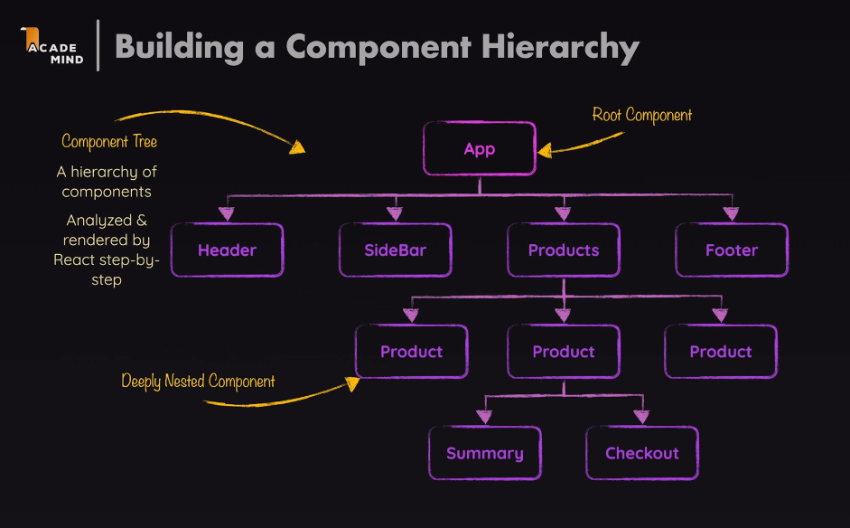
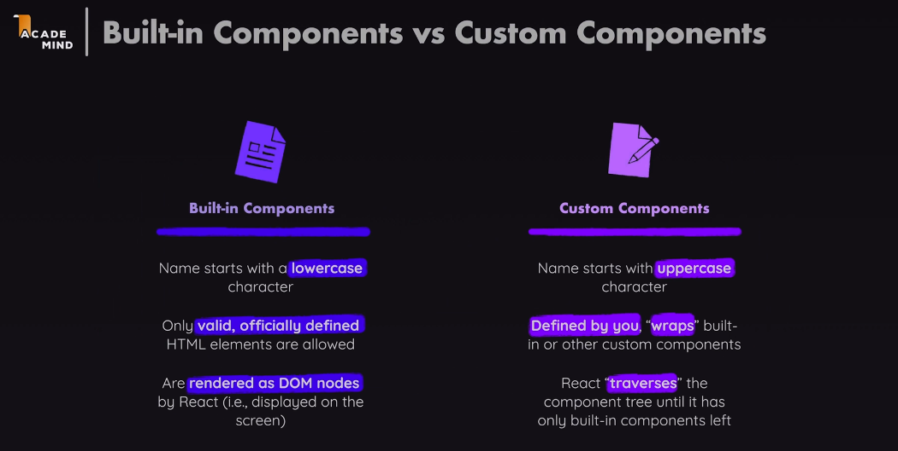
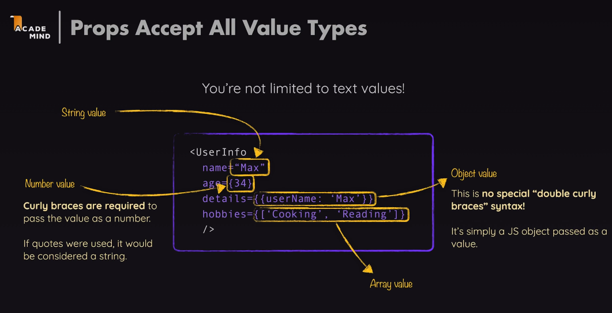
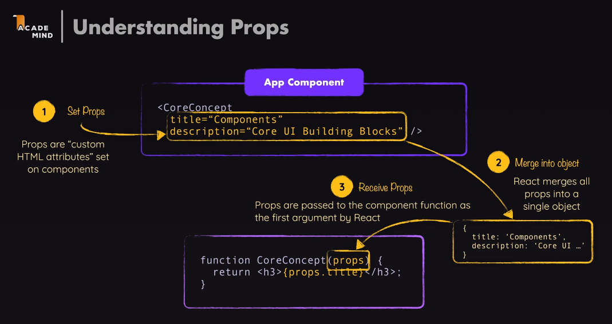
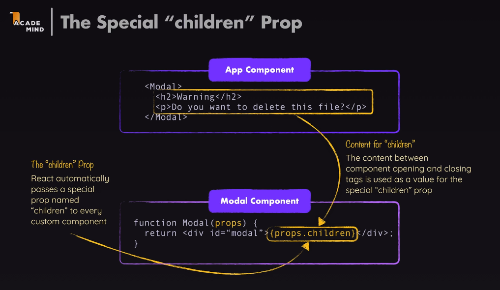
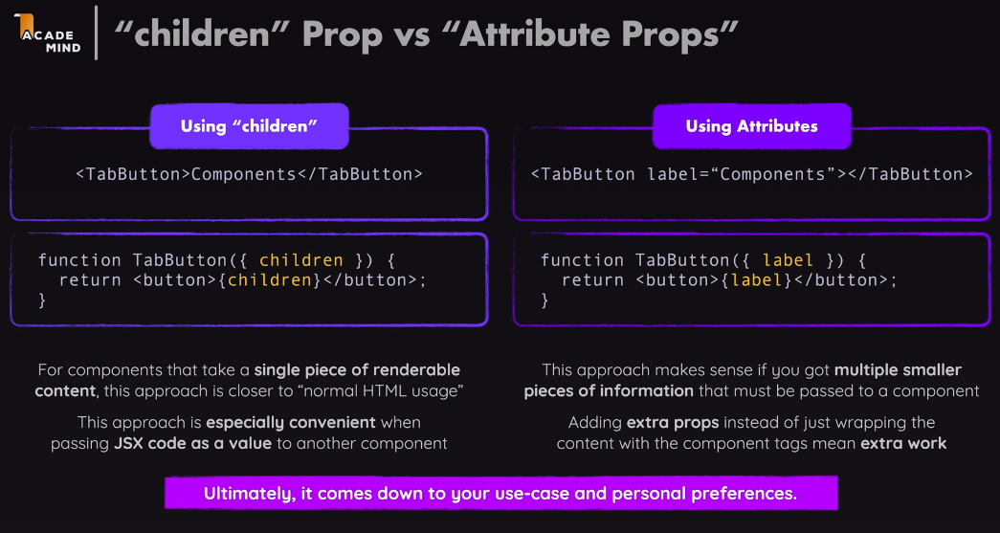
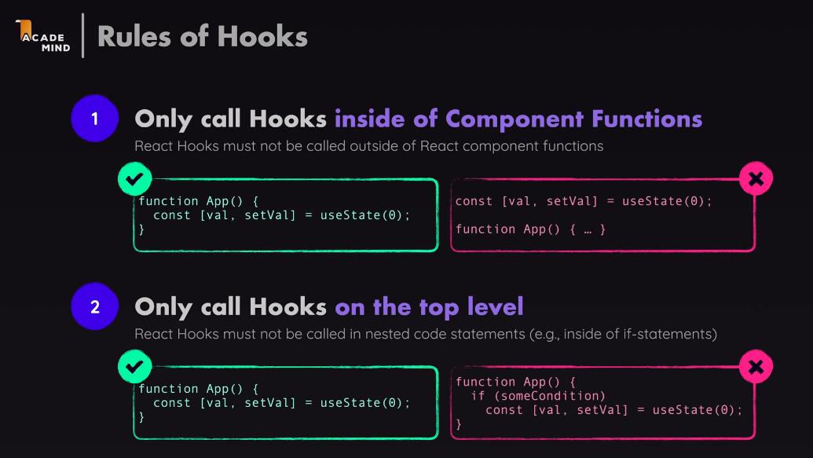
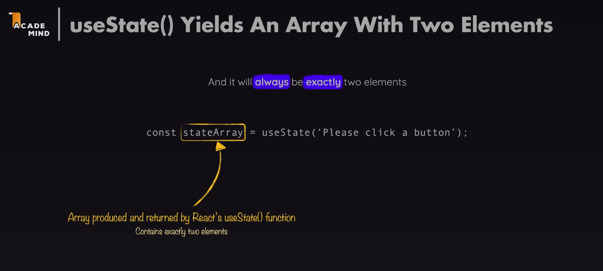

# React

https://academind.com/courses

__JSX__ = JavaScript XML (Extensible Markup Language) or Javascript Syntax Extension

__Declarative__ approach to building UIs: Use JSX to describe what the UI / HTML code should look like. Its about what you want to achieve, instead of how to do it. Define the target UI state(s) and let React handle the details.
  - Declarative programming in React allows developers to focus on the logic of the program, rather than the implementation details. 
  - This makes it easier to create responsive, reusable, and testable components. 
  - It also allows for rapid development, since changes can be made without needing to rewrite the entire application.

__Imperative__ approach to building UIs: Use JavaScript to describe what the UI should look like. Its about how to do it. 

Examples

<details>
<summary>imperative (js)</summary>

```js
<ul id="user-list"></ul>
<script>
  const users = ['Alice', 'Bob', 'Charlie'];
  const ul = document.getElementById('user-list');

  // Step-by-step instructions
  users.forEach(user => {
    const li = document.createElement('li');
    li.textContent = user;
    ul.appendChild(li);
  });
</script>
```
You explicitly instruct how to build the DOM:

1. Get the element.
1. Create a child.
1. Set text.
1. Append it.

```js
ul.innerHTML = ''; // clear
users.forEach(user => {
  const li = document.createElement('li');
  li.textContent = user;
  ul.appendChild(li);
});
```

You must manually remove old elements, and rebuild the DOM

</details>

<details>
<summary>declarative (jsx)</summary>

```jsx
function UserList() {
  const users = ['Alice', 'Bob', 'Charlie'];

  // Describe what the UI should look like
  return (
    <ul>
      {users.map(user => <li key={user}>{user}</li>)}
    </ul>
  );
}
```

You describe the final UI you want.

React handles:

1. Creating the DOM nodes.
1. Updating only what’s necessary if the data changes.

```jsx
const [users, setUsers] = useState(['Alice', 'Bob']);

useEffect(() => {
  setUsers(['Alice', 'Bob', 'Charlie']); // React re-renders automatically
}, []);
```

You just update the users state, and React re-renders.

</details>


React requires __build tools__ that provide an automated build process. The build process is the series of steps the tool performs to turn your raw source code into:
  - development code (served via a dev server),
  - or production-ready code (minified, bundled, and optimized).

The build process:
  - also removes the file type extensions on modules
  - `type="module"` is not needed for connecting js files to html files. It will instead bundle all the js files and inject them into the html file (using old syntax in the right order, which is done to accommodate older browsers that might not support es modules). The browser only needs to download a couple big files, instead of multiple small files. This basically eliminates the need for developers to write out a script tag for each js file.
  - node.js is used to run the build process.

These tools allow us to convert JSX to JavaScript and also minify the code when js files are built for optimized production when served to the browser. The most popular build tool is [Create React App](https://create-react-app.dev/) and [Vite](https://vitejs.dev/).

Create React App has `react-script` and `react-app-rewired` packages. `react-app-rewired` is a custom webpack configuration that allows us to use JSX in our JS files.

Create React App combines all jsx files into one js file, removing the need for modules.

Vite has `@vitejs/plugin-react` package which allows us to use JSX in our JS files.

We dont need `nodemon` for React, because the build tools automatically reload the page when changes are made to the code. This is called hot reloading, and it allows developers to see changes in real-time without having to manually refresh the page.


React builds by combining components. 
  - React components are really javascript functions that return JSX.
  - Components in JSX, are called the same way HTML elements are used in HTML files: With the same syntax for tagging.
  - React components are made from JSX, props, and state. 
  - Components are reusable pieces of code that can be used to build complex UIs. 
  - Components can be functional or class-based. 
  - Functional components are simpler and easier to read, while class-based components are more powerful and allow for more complex logic.
  - Components allow related code to be grouped together, making it easier to maintain and understand. Each component can have its own html, and js code (possibly css code as well), which makes it easier to manage and reuse code. 
  - Components allow separation of concerns, where each component is responsible for a specific part of the UI.
  - Components allow for easy testing and debugging, as they can be isolated and tested independently.


React components always follows these rules:
  - Components must return a single root element, meaning that they cannot return multiple elements.
  - Components must be named with a capital letter. (important for JSX to recognize them as custom components and not built-in HTML elements / host components)



__ReactDOM__ is the bridge between React and the DOM. It allows React to update the DOM when the state of a component changes. ReactDOM is used to render components to the DOM, and it also provides methods for updating and unmounting components. __ReactDOM.createRoot()__ and __ReactDOM.render()__ are two methods used to render React components to the DOM.

__ReactDOM.createRoot()__ is the method used to create a root element for a React application. It takes a single argument, which is the DOM element to render the React application to. This method is used to create a root element for the React application, and it is typically called in the entry point of the application.

```jsx
const root = ReactDOM.createRoot(document.getElementById('root'));
```

__ReactDOM.render()__ is the method used to render a React component, designated to be the root component, to the DOM. It takes two arguments: the component to render and the DOM element to render it to.

React will traverse the component tree and render each component to the DOM. Inside each of these components, React will render the hosted components. It will also update the DOM when the state of a component changes.

It derives a component tree, which is then used to perform commands that update the website DOM. 

```jsx
const root = ReactDOM.createRoot(document.getElementById('root'));
root.render(<App />);

// import { createRoot } from 'react-dom/client';
// createRoot(document.getElementById('root')).render(<App />);
```

Components can be nested inside other components, allowing for complex UIs to be built from simple building blocks. 

A __React Element__ is a description of what to render (any valid JSX basically). It is a plain object that describes a DOM node or a component instance. It contains information about the type of element, its properties, and its children. React elements are immutable, meaning that once they are created, they cannot be changed.

HTML elements nested inside JSX are called __React elements__. They are the building blocks of React applications. React elements are created using JSX syntax, which allows developers to write HTML-like code inside JavaScript files. 

## React Rendering Process: 

1. JSX is compiled, becoming nested calls to `React.createElement()`. This will create a React element, which is a plain object that describes the component and its properties.
1. The calls start at the root component, recursively calling the components, creating React elements for each custom component / host component, forming a tree structure: the Virtual DOM. 
1. React compares the virtual DOM tree to the previous version of the virtual DOM tree (if it exists) using a process called reconciliation.
1. React updates the actual DOM based on the differences between the two virtual DOM trees. This is done by React through `ReactDOM`, which creates real DOM nodes (created with `document.createElement()`) and updates their properties (e.g. innerText, className) based on the React elements and updates the actual DOM accordingly.
1. Repeat steps 2-4 whenever the state of a component changes, or when a component is re-rendered.

<details>
<summary>Host Components vs Custom Components</summary>



</details>

```jsx
function App() {
  return (
    <div>
      <h1>Hello</h1>
      <Greeting name="Jacky" />
    </div>
  );
}
```
```jsx
// under the hood
React.createElement(
  'div',
  null,
  React.createElement('h1', null, 'Hello'),
  React.createElement(Greeting, { name: 'Jacky' })
);
```
```jsx
//example of a host component
// JSX
<div>Hello</div>

// ↓ compiles to ↓
React.createElement('div', null, 'Hello')

// ↓ React builds virtual DOM tree
{
  type: 'div',
  props: { children: 'Hello' }
}

// ↓ ReactDOM reconciles & renders to real DOM
document.createElement('div') → sets innerText to "Hello"
```

---

# Dynamic Content


Expressions do not accept statements, loops, function declarations, or any other code that does not evaluate to a value. 

==Expressions are anything that produces a value==

# Loading Images

Using `import` to load images is the recommended way in React, as it allows the build tool to optimize the image loading process. This is because the build tool can analyze the image and generate a unique hash for it, which can be used to cache the image in the browser. This is unique to React's build process and is not a standard JavaScript feature.

Using the standard `src` attribute to load images is not recommended in React, as it does not allow the build tool to optimize the image loading process. This can lead to slower loading times and larger bundle sizes. It <ins>might not load the image at all</ins>. 

Because importing is a value, it can be used inside JSX expressions. ==This allows you to dynamically load images based on the component's state or props.==

```jsx
import logo from './logo.png';

function App() {
  return (
    <div>
      
    </div>
  )
}
```

--- 

# Props

Any function (component) created on React accepts a single argument, which is an object containing the properties passed to the component. This object is called `props`. It can be called anything, but `props` is the convention.

Props (short for properties) / custom attributes are a way to pass data from a parent component to a child component in React. They are used to configure the child component and can be any valid JavaScript value, including strings, numbers, arrays, objects, and functions. 

==Recall that html elements inside JSX are technically React components, so attributes passed to html elements in JSX are also props.==

__Props are passed to a component using the `props` object.__ You can access props using the `this.props` keyword inside a class component.

```jsx
function App(props) {
  return (
    <div>
      <h1>Hello, {props.name}!</h1>
    </div>
  );
}
```




"props" are passed to a component as attributes in JSX, similar to how HTML attributes are passed to HTML elements. Components can accept any number of props, and they can be of any type. 

We can destructure props to extract specific values from the props object. This is a common practice in React to make the code more readable and concise. Instead of destructing every prop, we can use __rest parameters__ to collect all remaining props into an object (==though that would be the same as passing props to a component, since props is already an object==).

```jsx
function App({ name }) {
  return (
    <div>
      <h1>Hello, {name}!</h1>
    </div>
  );
}
```

__Rest Parameters__ can be used to collect all remaining props into an object. This is useful when you want to pass all props to a child component without explicitly defining each prop (which is already done with props itself). Though this is uncommon, it can be useful in some cases like when you want to pass all props to a third-party component that accepts a lot of props.

```jsx
function App(props) {
  return (
    <div>
      <Greeting name={props.name} age={props.age} />
    </div>
  );
}

function Greeting({ ...props }) {
  return (
    <div>
      <h1>Hello, {props.name}!</h1>
      <p>Age: {props.age}</p>
    </div>
  );
}

// HOC, Higher Order Component example: 
function withLogging(WrappedComponent) {
  return function LoggedComponent(...args) {
    console.log('Rendering with props:', args);
    return <WrappedComponent {...args[0]} />;
  };
}
```

__Spread Operators__ can also be used to pass props to a component. They are syntactically the same as the spread operator in JavaScript.

==When you spread props, you spread HTML-like attributes basically.==

```jsx
function App(props) {
  return (
    <div>
      <Greeting {...props} />
    </div>
  );
}

is the same as:

function App(props) {
  return (
    <div>
      <Greeting name={props.name} age={props.age} />
    </div>
  );
}
```

__Default Parameters__ can be used to set default values for props. This is useful when you want to provide a default value for a prop if it is not passed to the component.

```jsx
function App({ name = 'John' }) {
  return (
    <div>
      <h1>Hello, {name}!</h1>
    </div>
  );
}
```

```jsx
//without destructuring
function App(props) {
  const { name = 'John' } = props;
  return (
    <div>
      <h1>Hello, {name}!</h1>
    </div>
  );
}
```

__children__ is a special prop that is used to pass child elements to a component. It is used to render the content inside a component. The `props.children` prop can be any valid React element, including strings, numbers, arrays, and other components.



Using children props vs attribute props really <ins>comes down to preference</ins>. 

In general:

__Attribute props__ are used for configuration, to give components attributes as well (other html elements that can accept attributes for example).  
__Children props__ are more for passing content to a component, like text or other jsx elements.



# Modular Components and CSS

Reminder that even though you can make css modular, they are not scoped to the component even if you import them to the component file specifically. This is because the css is still global, and it will apply to all elements that match the css selectors.

Styles can be scope to a component by using ==CSS Modules== that are interpreted by the build tool, which allows you to write CSS that is scoped to a specific component. This is done by importing the CSS file as a module and using the class names as properties of the imported object.

__Behind the scenes__, the build tool uses a CSS Modules loader that:

- Parses the CSS
- Generates scoped, hashed class names
- Replaces the import with an object like:

```js
{
  container: 'App_container__1a2b3',
  title: 'App_title__4d5e6'
}
```

```jsx
import styles from './App.module.css';

//app.module.css
.container {
  text-align: center;
}
.title {
  color: blue;
}


function App() {
  return (
    <div className={styles.container}>
      <h1 className={styles.title}>Hello, World!</h1>
    </div>
  );
}
```

# CSS Classes 

When using class attributes in JSX, you must use `className` instead of `class`. This is because `class` is a reserved keyword in JavaScript, and React uses `className` to avoid conflicts. ==Other attributes will follow the same camelCase syntax.==

# Event Handlers

We do not manipulate the DOM directly in React, so we use attribute handlers to handle events. This is done by passing a function to the event handler attribute, which will be called when the event occurs.

We do not use any javascript event handlers like `onclick` or `onchange` in JSX. Instead, we use camelCase syntax for event handlers, like `onClick`, `onChange`, etc. 

When calling a function from an event handler, its <ins>important to know when to use parentheses and when not to use them.</ins>  

 - `onClick={handleClick}` Using without parentheses means that the event is ONLY calling the function only when the event occurs. 
 - `onClick={handleClick()}` Using with parentheses means that the function is called immediately when the component is rendered / runtime, which is not what we want. This will cause the function to be executed immediately, instead of waiting for the event to occur.
 - `onClick={() => handleClick()}` Creating an anonymous function here allows you to pass arguments to a function, but restrict its call to the event handler only. The anon function acts as the value being passed. This is useful when you want to pass additional data to the event handler or additional logic to the function. 

# React Hooks
__React hooks__ are functions that allow you to use React features in functional components. They are used to manage state, side effects, and other React features without using class components.

React hooks must be called at the top level of a functional component, and they cannot be called inside loops, conditions, or nested functions. This is because React needs to keep track of the order in which hooks are called, and calling them conditionally or inside loops would break that order.



# React State
React only executes the code inside a component when it is first rendered. Having states allows us to change the component's output when the state changes, without having to re-render the entire component.

States can be used to store data that is local to the component. This data is private to the component and cannot be accessed outside of the component.

`useState` is a React hook that allows you to add state to a functional component. It returns an array with two elements: the current state value and a function to update the state value. 

useState accepts a current initial value, and since its a function, it ==returns an array with two elements: the current state value and a function to update the state value.==



With array destructuring, we can assign the two elements to variables for example:

```jsx
const [count, setCount] = useState(0);
```

The `count` variable will hold the current state value, and the `setCount` function will be used to update the state value.
