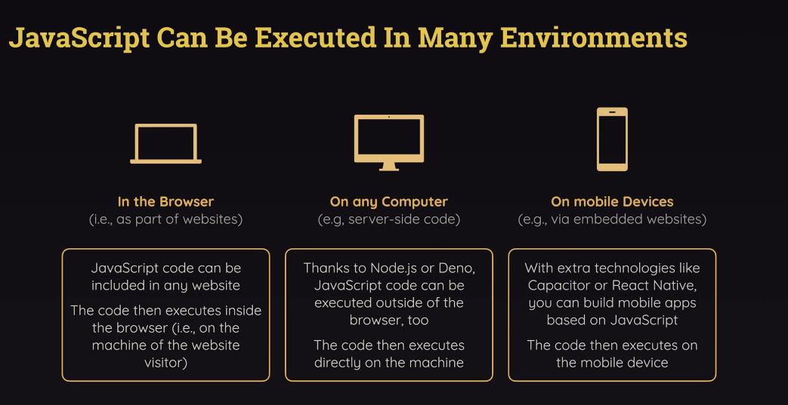

# React

https://academind.com/courses


__Declarative__ approach to building UIs: Use JSX to describe what the UI should look like. Its about what you want to achieve, instead of how to do it. Define the target UI state(s) and let React handle the details.
  - Declarative programming in React allows developers to focus on the logic of the program, rather than the implementation details. 
  - This makes it easier to create responsive, reusable, and testable components. 
  - It also allows for rapid development, since changes can be made without needing to rewrite the entire application.

__Imperative__ approach to building UIs: Use JavaScript to describe what the UI should look like. Its about how to do it. 

Examples

<details>
<summary>imperative (js)</summary>

```js
<ul id="user-list"></ul>
<script>
  const users = ['Alice', 'Bob', 'Charlie'];
  const ul = document.getElementById('user-list');

  // Step-by-step instructions
  users.forEach(user => {
    const li = document.createElement('li');
    li.textContent = user;
    ul.appendChild(li);
  });
</script>
```
You explicitly instruct how to build the DOM:

1. Get the element.
1. Create a child.
1. Set text.
1. Append it.

```js
ul.innerHTML = ''; // clear
users.forEach(user => {
  const li = document.createElement('li');
  li.textContent = user;
  ul.appendChild(li);
});
```

You must manually remove old elements, and rebuild the DOM

</details>

<details>
<summary>declarative (jsx)</summary>

```jsx
function UserList() {
  const users = ['Alice', 'Bob', 'Charlie'];

  // Describe what the UI should look like
  return (
    <ul>
      {users.map(user => <li key={user}>{user}</li>)}
    </ul>
  );
}
```

You describe the final UI you want.

React handles:

1. Creating the DOM nodes.
1. Updating only what’s necessary if the data changes.

```jsx
const [users, setUsers] = useState(['Alice', 'Bob']);

useEffect(() => {
  setUsers(['Alice', 'Bob', 'Charlie']); // React re-renders automatically
}, []);
```

You just update the users state, and React re-renders.

</details>



React requires __build tools__ that provide an automated build process. The build process is the series of steps the tool performs to turn your raw source code into:
  - development code (served via a dev server),
  - or production-ready code (minified, bundled, and optimized).

The build process:
  - also removes the file type extensions on modules
  - `type="module"` is not needed for connecting js files to html files. It will instead bundle all the js files and inject them into the html file (using old syntax in the right order, which is done to accommodate older browsers that might not support es modules). The browser only needs to download a couple big files, instead of multiple small files. This basically eliminates the need for developers to write out a script tag for each js file.
  - node.js is used to run the build process.

These tools allow us to convert JSX to JavaScript and also minify the code when js files are built for optimized production when served to the browser. The most popular build tool is [Create React App](https://create-react-app.dev/) and [Vite](https://vitejs.dev/).

Create React App has `react-script` and `react-app-rewired` packages. `react-app-rewired` is a custom webpack configuration that allows us to use JSX in our JS files.

Create React App combines all jsx files into one js file, removing the need for modules.

Vite has `@vitejs/plugin-react` package which allows us to use JSX in our JS files.