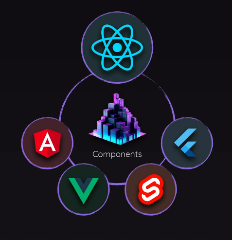

# React

https://academind.com/courses

__JSX__ = JavaScript XML (Extensible Markup Language) or Javascript Syntax Extension

__Declarative__ approach to building UIs: Use JSX to describe what the UI / HTML code should look like. Its about what you want to achieve, instead of how to do it. Define the target UI state(s) and let React handle the details.
  - Declarative programming in React allows developers to focus on the logic of the program, rather than the implementation details. 
  - This makes it easier to create responsive, reusable, and testable components. 
  - It also allows for rapid development, since changes can be made without needing to rewrite the entire application.

__Imperative__ approach to building UIs: Use JavaScript to describe what the UI should look like. Its about how to do it. 

Examples

<details>
<summary>imperative (js)</summary>

```js
<ul id="user-list"></ul>
<script>
  const users = ['Alice', 'Bob', 'Charlie'];
  const ul = document.getElementById('user-list');

  // Step-by-step instructions
  users.forEach(user => {
    const li = document.createElement('li');
    li.textContent = user;
    ul.appendChild(li);
  });
</script>
```
You explicitly instruct how to build the DOM:

1. Get the element.
1. Create a child.
1. Set text.
1. Append it.

```js
ul.innerHTML = ''; // clear
users.forEach(user => {
  const li = document.createElement('li');
  li.textContent = user;
  ul.appendChild(li);
});
```

You must manually remove old elements, and rebuild the DOM

</details>

<details>
<summary>declarative (jsx)</summary>

```jsx
function UserList() {
  const users = ['Alice', 'Bob', 'Charlie'];

  // Describe what the UI should look like
  return (
    <ul>
      {users.map(user => <li key={user}>{user}</li>)}
    </ul>
  );
}
```

You describe the final UI you want.

React handles:

1. Creating the DOM nodes.
1. Updating only what’s necessary if the data changes.

```jsx
const [users, setUsers] = useState(['Alice', 'Bob']);

useEffect(() => {
  setUsers(['Alice', 'Bob', 'Charlie']); // React re-renders automatically
}, []);
```

You just update the users state, and React re-renders.

</details>


React requires __build tools__ that provide an automated build process. The build process is the series of steps the tool performs to turn your raw source code into:
  - development code (served via a dev server),
  - or production-ready code (minified, bundled, and optimized).

The build process:
  - also removes the file type extensions on modules
  - `type="module"` is not needed for connecting js files to html files. It will instead bundle all the js files and inject them into the html file (using old syntax in the right order, which is done to accommodate older browsers that might not support es modules). The browser only needs to download a couple big files, instead of multiple small files. This basically eliminates the need for developers to write out a script tag for each js file.
  - node.js is used to run the build process.

These tools allow us to convert JSX to JavaScript and also minify the code when js files are built for optimized production when served to the browser. The most popular build tool is [Create React App](https://create-react-app.dev/) and [Vite](https://vitejs.dev/).

Create React App has `react-script` and `react-app-rewired` packages. `react-app-rewired` is a custom webpack configuration that allows us to use JSX in our JS files.

Create React App combines all jsx files into one js file, removing the need for modules.

Vite has `@vitejs/plugin-react` package which allows us to use JSX in our JS files.

We dont need `nodemon` for React, because the build tools automatically reload the page when changes are made to the code. This is called hot reloading, and it allows developers to see changes in real-time without having to manually refresh the page.


React builds by combining components. 
  - React components are really javascript functions that return JSX.
  - Components in JSX, are called the same way HTML elements are used in HTML files: With the same syntax for tagging.
  - React components are made from JSX, props, and state. 
  - Components are reusable pieces of code that can be used to build complex UIs. 
  - Components can be functional or class-based. 
  - Functional components are simpler and easier to read, while class-based components are more powerful and allow for more complex logic.
  - Components allow related code to be grouped together, making it easier to maintain and understand. Each component can have its own html, and js code (possibly css code as well), which makes it easier to manage and reuse code. 
  - Components allow separation of concerns, where each component is responsible for a specific part of the UI.
  - Components allow for easy testing and debugging, as they can be isolated and tested independently.



React components always follows these rules:
  - Components must return a single root element, meaning that they cannot return multiple elements.
  - Components must be named with a capital letter. (important for JSX to recognize them as custom components and not built-in HTML elements / host components)


__ReactDOM__ is the bridge between React and the DOM. It allows React to update the DOM when the state of a component changes. ReactDOM is used to render components to the DOM, and it also provides methods for updating and unmounting components. __ReactDOM.createRoot()__ and __ReactDOM.render()__ are two methods used to render React components to the DOM.

__ReactDOM.createRoot()__ is the method used to create a root element for a React application. It takes a single argument, which is the DOM element to render the React application to. This method is used to create a root element for the React application, and it is typically called in the entry point of the application.

```jsx
const root = ReactDOM.createRoot(document.getElementById('root'));
```

__ReactDOM.render()__ is the method used to render a React component, designated to be the root component, to the DOM. It takes two arguments: the component to render and the DOM element to render it to.

React will traverse the component tree and render each component to the DOM. Inside each of these components, React will render the hosted components. It will also update the DOM when the state of a component changes.

It derives a component tree, which is then used to perform commands that update the website DOM. 

```jsx
const root = ReactDOM.createRoot(document.getElementById('root'));
root.render(<App />);

// import { createRoot } from 'react-dom/client';
// createRoot(document.getElementById('root')).render(<App />);
```

Components can be nested inside other components, allowing for complex UIs to be built from simple building blocks. 

A __React Element__ is a description of what to render (any valid JSX basically). It is a plain object that describes a DOM node or a component instance. It contains information about the type of element, its properties, and its children. React elements are immutable, meaning that once they are created, they cannot be changed.

HTML elements nested inside JSX are called __React elements__. They are the building blocks of React applications. React elements are created using JSX syntax, which allows developers to write HTML-like code inside JavaScript files. 

## React Rendering Process: 

1. JSX is compiled, becoming nested calls to `React.createElement()`. This will create a React element, which is a plain object that describes the component and its properties.
1. The calls start at the root component, recursively calling the components, creating React elements for each custom component / host component, forming a tree structure: the Virtual DOM. 
1. React compares the virtual DOM tree to the previous version of the virtual DOM tree (if it exists) using a process called reconciliation.
1. React updates the actual DOM based on the differences between the two virtual DOM trees. This is done by React through `ReactDOM`, which creates real DOM nodes (created with `document.createElement()`) and updates their properties (e.g. innerText, className) based on the React elements and updates the actual DOM accordingly.
1. Repeat steps 2-4 whenever the state of a component changes, or when a component is re-rendered.

<details>
<summary>Host Components vs Custom Components</summary>


</details>

```jsx
function App() {
  return (
    <div>
      <h1>Hello</h1>
      <Greeting name="Jacky" />
    </div>
  );
}
```
```jsx
// under the hood
React.createElement(
  'div',
  null,
  React.createElement('h1', null, 'Hello'),
  React.createElement(Greeting, { name: 'Jacky' })
);
```
```jsx
//example of a host component
// JSX
<div>Hello</div>

// ↓ compiles to ↓
React.createElement('div', null, 'Hello')

// ↓ React builds virtual DOM tree
{
  type: 'div',
  props: { children: 'Hello' }
}

// ↓ ReactDOM reconciles & renders to real DOM
document.createElement('div') → sets innerText to "Hello"
```


