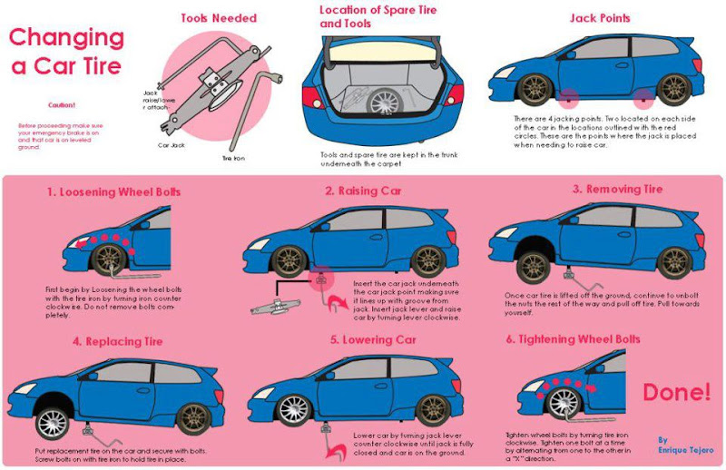
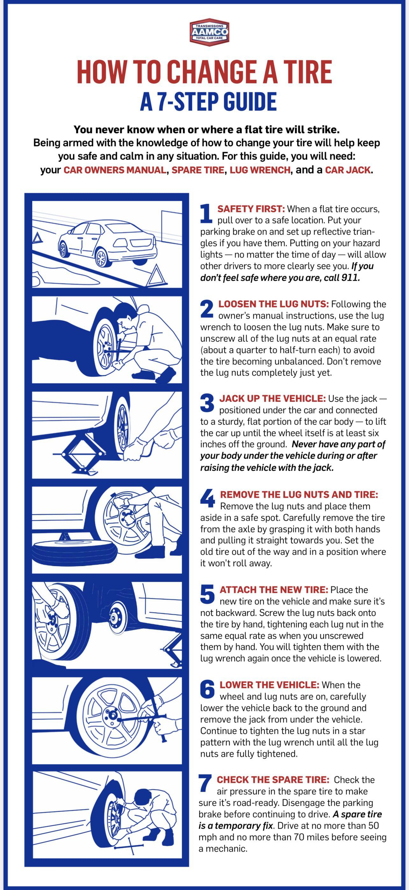
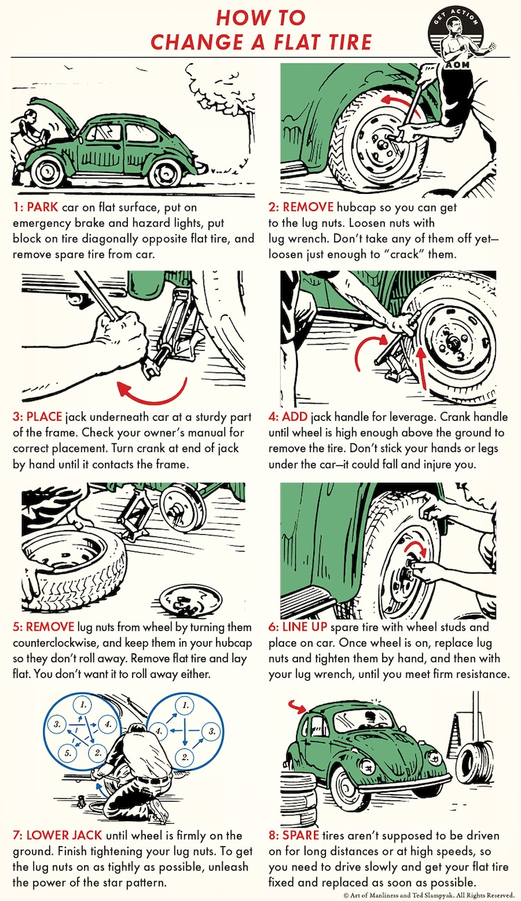

# Maintenance

<mark>“Keep it running and improving.”</mark>

- Oil Change - Check and change engine oil regularly to keep the engine running smoothly.
- Fluid Levels - Check and top up all fluid levels, including coolant, transmission fluid, and windshield washer fluid.
- Battery - Inspect the battery for corrosion and ensure it is holding a charge.
- Change Tires - Replace worn or damaged tires to ensure the vehicle is safe and efficient.
- Tire Pressure - Check and maintain proper tire pressure for safety and fuel efficiency.
- Brake Pads - Inspect brake pads for wear and replace them if necessary to ensure safe braking. 
- Brake Fluid - Check and change brake fluid to ensure the brakes are working properly.

## Oil Change

[Changing your oil](https://www.youtube.com/watch?v=XIM6XVd2xHU)  
[Checking your oil](https://aamcoblogadmin.pwmedia.net/data/Blog/AAMCO_Illustration_How_to_Change_Your_Oil_400px.jpg)

Because oil lubricates the engine, it is essential to change it regularly to prevent engine wear and tear. Old oil can become contaminated with dirt, debris, and other particles, which can lead to engine damage if not changed regularly. Oil can deteriorate over time, losing its ability to lubricate and protect the engine. Regular oil changes help maintain the engine's performance and extend its lifespan.

- **Frequency**: Every 3 to 5 years or as recommended by the manufacturer. 5 years usually. Oil filter should be changed every oil change or every other oil change.
- **Purpose**: To keep the engine lubricated and running smoothly.
- **Procedure**:
  1. Check the oil level using the dipstick. Make sure the oil color is not dark brown or black, and that it is not gritty. Check the oil level against the minimum and maximum marks on the dipstick to determine if it is low.
  2. If the oil is clean and at the proper level, you can leave it as is.
  3. If the oil is dirty or low, drain the old oil at the bottom of the tank and replace it with new oil at the top of the tank.
  4. Replace the __oil filter__ if necessary. (found near the oil tank below, or on the side of the engine)

## Fluid Levels

- __Brake fluid__ - can be checked by looking at the reservoir under the hood. If it is extremely low, it indicates there is a leak in the brake system or the __brake pads__ are thinning out. Most USA vehicles take DOT 3 or DOT 4 brake fluid. Brake fluid should be changed every 2-3 years or 20k to 45k miles.
  - [Change Procedure](https://www.youtube.com/shorts/e8oIKJots0c): 
      1. Drain the brake fluid from each of the wheel cylinders located at each wheel. If done manually, make sure the tube to drain is submerged in fluid to prevent air from entering the brake system by accident.
      1. Use can use a brake bleeder kit to make the process easier. A brake bleeder kit is a tool that helps remove air from the brake lines and ensures that the brake fluid is at the proper level.
      1. Replace the fluid with new brake fluid at the top of the reservoir.
- __Coolant__ - used to regulate the temperature of the engine. Loss is normal and can be checked by looking at the reservoir under the hood. If it is low, add more coolant.  Coolant should be changed every 2-5 years or 30k to 50k miles.
- __Transmission fluid__ - lubricates the transmission(gears and clutch). Fluid should remain constant or it indicates a leak and can be checked by looking at the reservoir under the hood. If it is low, add more transmission fluid. Replace transmission fluid at every 30k to 60k miles for manual, vs 60k to 100k miles for automatic, or by the color of the fluid. 
- __Windshield wiper / washer fluid__ - used to spray and clean the windshield and wipers. Fluid can be checked by looking at the reservoir under the hood. If it is low, add more windshield washer fluid. Fluid comes in a variety of colors that indicate the type of fluid, such as blue, green, or orange. It is important to use the correct type of fluid for your vehicle (use cases are specific are not always tied to the color of the fluid):
  - Blue is a water-based fluid that is safe for all vehicles and is the most common type of windshield washer fluid.
  - Green is a concentrated fluid that is designed for use in colder climates and is more effective at removing ice and snow from the windshield and a bug repellent / remover.
  - Orange is a synthetic fluid that is used in hot weather and is less effective at removing ice and snow from the windshield.
- __Power steering fluid__ - used to lubricate the power steering system and make it easier to turn the steering wheel. Fluid can be checked by looking at the reservoir under the hood. If it is low, add more power steering fluid. Power steering fluid should be changed every 2-4 years, or 30k to 60k miles or by color. 

## Change Tires

[video](https://www.youtube.com/shorts/bInihYJPtEU)

## Tire Pressure

Checking tire pressure is important for safety and fuel efficiency. Under-inflated tires can cause poor handling, reduced fuel economy, and increased tire wear. Over-inflated tires can cause a harsh ride and increase the risk of a blowout. Check tire pressure with a tire pressure gauge, which can be purchased at an auto parts store or online. The recommended tire pressure (PSI) for your vehicle can usually be found on a sticker inside the driver's door or in the owner's manual.

## Spark Plugs

Used to ignite the air-fuel mixture in the engine's cylinders. Located at the top of the engine. They wear out over time and need to be replaced to ensure proper engine performance. Spark plugs should be replaced every 30k to 100k miles, depending on the type of spark plug and the manufacturer's recommendations. 